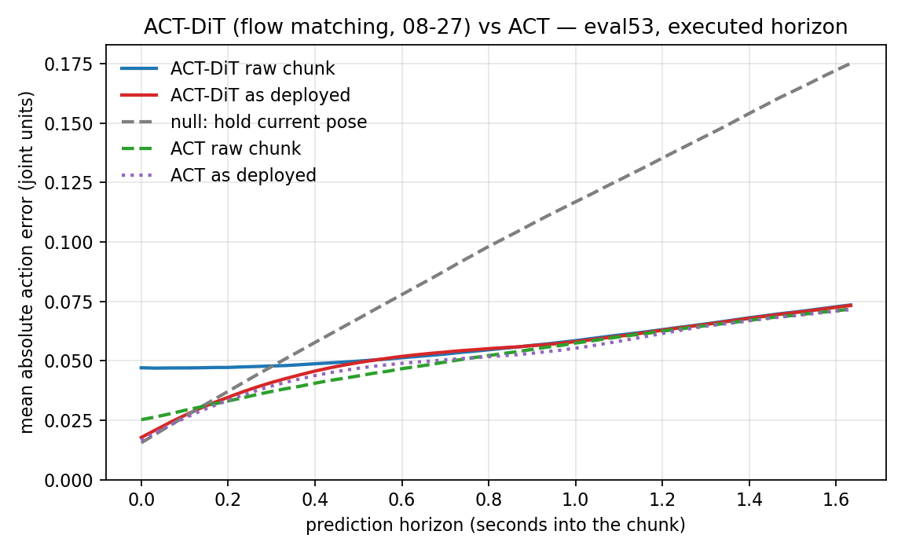

# ACT-DiT（flow matching + EMA，08-27 复训）在部署忠实评测下：与 08-20 那版是同一个模型

**被评 checkpoint** `/mnt/robot_platform/jobs/act_dit_tidy_up_stationery_le_batch_success_361_2026-08-27_04-32-02-437338/run/checkpoints/last/pretrained_model`（200 000 步）
**Policy** `act_dit` — `objective: flow_matching`（Euler，`num_integration_steps` 10，`timestep_sampling` beta 1.5/1.0），`chunk_size` 100，`use_vae` false，`use_cross_attention` true，`use_ema` true（decay 0.9999），ResNet18，**LR 1e-4 / backbone 1e-5**，adamw，无 scheduler
**训练集** `tidy_up_stationery_le/batch_success_361`（363 episodes，`dataset_episodes: null`，仍无留出验证集）
**评测方法** [`../test_scripts/scripts_act_eval_test_fix/`](../test_scripts/scripts_act_eval_test_fix/README.md) —— 部署忠实的离线 chunk 评测：只评真机会执行的前 **50** 帧，且评的是 `core.send_next_action_chunk` **重写之后**发给机械臂的那条轨迹（4 个滤波器 + K=40 Hermite 桥），不是 `predict_action_chunk` 的原始输出
**对照** ACT baseline（`act_tidy_up_stationery_le_batch_success_361_2026-08-17`）、前一版 act_dit flow matching（`2026-08-20_22-59-31`）
**测量日期** 2026-08-30，mgmt01（RTX 4090），`/opt/robot-platform/train-venv` + `PYTHONPATH=/home/kewei/YING/lerobot_vlahost/src`
**脚本与原始数据** [`../test_scripts/scripts_act_dit_eval_fix/`](../test_scripts/scripts_act_dit_eval_fix/)

---

## 1. 结论

1. **这批权重和 08-20 那版是同一个配方，指标也一样。** 两个 job 的 `train_config.json`
   逐字段相同（只差 `output_dir`），loss 曲线到小数点后三位重合，权重张量确实不同
   （中位相对 L2 11%，属于 200k 步非确定性训练的正常发散）。评测下来
   eval53 raw **0.0567 vs 0.0571**（差 0.7%），deployed **0.0528 vs 0.0530**（差 0.4%），
   训练集内 0.0341 vs 0.0344。**这是一次复跑，不是一次改动**（§4）。
   如果 08-27 这次实际改了源码（配置文件里看不出来的那种改动），请告诉我改了什么，我按变量重测。

2. **在指定评测集上，它比"原地不动"好 1.84×，但仍略差于 ACT baseline。**
   eval53 上 deployed **0.0528**，空策略 0.0970，ACT baseline 0.0509。
   raw chunk 的差距更大：0.0567 vs ACT 的 0.0511（差 11%）。

3. **训练集内差 2.9 倍，held-out 上打平。** 训练集 raw MAE act_dit **0.0341** vs ACT **0.0118**；
   而在 held-out `batch_1`–`batch_6`（过滤后）上两者是 **0.0948 vs 0.0944**，差 0.4%，
   deployed 后 **0.0840 vs 0.0839**。**act_dit 用弱得多的训练集拟合，换来了完全相同的泛化误差。**
   held-out 的误差水平由数据分布决定，两个模型都顶在同一个天花板上（§5）。

4. **chunk 开头仍然是错的，而 deploy 的 Hermite 桥正好把它盖住了。** eval53 上 chunk 第一帧
   raw 误差 **0.0471**，是空策略（0.0156）的 **3.0 倍**，ACT 是 0.0253（1.6 倍）；
   raw 曲线要到第 **11** 帧（0.37 s）才低于空策略，ACT 第 6 帧。
   这与前两篇报告记录的"第一帧偏差"是同一个现象，换成 flow matching + EMA 之后仍在（§6）。

5. **因此 deploy 的重写在 act_dit 上处处是净收益，方向与 ACT 相反。** K=40 桥在
   训练集内 −2.7%、`batch_4` 已见半 −17.3%、eval53 −6.8%、held-out −11.4%；
   同一个桥在 ACT 上是训练集内 **+88.8%**、`batch_4` 已见半 **+43.1%**（[fix 版 README §4](../test_scripts/scripts_act_eval_test_fix/README.md)）。
   桥用"从实测位姿出发的 S 曲线"替换了 50 帧里的前 40 帧——对 chunk 开头本来就错的模型，
   这是修补；对开头本来就对的模型，这是破坏。**act_dit 在真机上表现"还行"的部分原因是它的输出被替换掉了 80%**（§7）。

**一句话**：这次没有引入新变量，结论沿用 08-20——flow matching + EMA 是目前最好的 act_dit 配置，
但它在训练集内的拟合能力远不及 ACT，泛化上也没有超过 ACT，且 chunk 开头的系统偏差依然存在。

---

## 2. 口径（与 ACT 报告完全一致，便于横向比）

| 项 | 取值 |
|---|---|
| 执行 horizon | 50 帧（`deploy_config_act_dit.yaml:153` `n_action_steps: 50`，30 fps ≈ 1.67 s） |
| 评的是什么 | `policy_deployed` = 经过 rollback 去除、夹爪回环去除、二项平滑、大摆动线性化、**K=40 Hermite 桥**、夹爪 clip 之后，真正 POST 给 `/action_chunk` 的 50 个 waypoint |
| `policy_raw` | 模型自己的 chunk 前 50 帧，未经重写 |
| `hold_state` | 空策略：50 帧全部保持当前实测位姿 |
| anchor | stride 20，逐帧从演示状态开环起评（teacher forced，非闭环 rollout） |
| latency | `--latency-steps 0` |
| 采样 | flow matching Euler 10 步，**EMA 权重**（`policy.eval()` → shadow 生效，与真机 `select_action` 一致） |

各条件规模：

| 条件 | episodes | frames | anchors | anchor-steps | 因指纹重叠丢弃 |
|---|---:|---:|---:|---:|---:|
| eval53 `batch_success_53_eval_data` | 53 | 40 132 | 2 007 | 97 090 | 0 |
| held-out `batch_1`–`batch_6`（过滤后） | 263 | 208 033 | 8 897 | 428 784 | 30（`batch_5`/`batch_6` 整集被跳过） |
| 训练集内 `batch_success_361` | 363 | 300 689 | 15 035 | 729 410 | — |
| `batch_4` 已见半（同场次对照） | 30 | 67 294 | 1 507 | 73 424 | 50（保留的正是重叠的那 30 个） |

> **加载注意**：`/opt/robot-platform/train-venv` 里装的 `lerobot` 0.6.0 的 `ACTDiTConfig`
> **还没有 `use_ema` / `ema_decay`**，直接跑会 `DecodingError: The fields use_ema, ema_decay
> are not valid for ACTDiTConfig`。必须 `PYTHONPATH=/home/kewei/YING/lerobot_vlahost/src`
> 前置（EMA 的实现在那份源码里）。gpu05 上训练用的 venv 是新的，mgmt01 上这份是旧的。

---

## 3. 主结果（executed horizon 50）

| 条件 | `policy_raw` | `policy_deployed` | `hold_state`（空策略） | deployed vs 空策略 | norm. MAE |
|---|---:|---:|---:|---:|---:|
| **eval53（指定评测集）** | 0.0567 | **0.0528** | 0.0970 | **1.84×** | 0.164 |
| held-out `batch_1`–`batch_6` | 0.0948 | 0.0840 | 0.0975 | 1.16× | 0.252 |
| 训练集内 `batch_success_361` | 0.0341 | 0.0331 | 0.0873 | 2.63× | 0.101 |
| `batch_4` 已见半 | 0.0321 | 0.0265 | 0.0634 | 2.39× | 0.081 |

按 horizon 累积（MAE 累到第 k 帧，30 fps）：

| 条件 / 曲线 | @1 | @10 | @25 | @50 |
|---|---:|---:|---:|---:|
| eval53 raw | 0.0471 | 0.0473 | 0.0495 | 0.0567 |
| eval53 deployed | 0.0178 | 0.0304 | 0.0422 | 0.0528 |
| eval53 空策略 | 0.0156 | 0.0317 | 0.0572 | 0.0970 |
| 训练集内 raw | 0.0409 | 0.0388 | 0.0360 | 0.0341 |
| 训练集内 deployed | 0.0154 | 0.0261 | 0.0336 | 0.0331 |
| held-out raw | 0.0646 | 0.0671 | 0.0760 | 0.0948 |
| held-out deployed | 0.0230 | 0.0375 | 0.0569 | 0.0840 |

**训练集内那一行是这次最刺眼的数字**：raw 的累积 MAE **随 horizon 单调下降**
（0.0409 → 0.0341）。正常的开环预测误差应该随 horizon 上升（ACT 就是：0.0103 → 0.0118）。
下降意味着**误差集中在 chunk 的最前面**——模型对自己刚看到的那一帧的动作，预测得比 1.6 秒后还差，
而且这是在**训练数据上**。这不是泛化问题，是 chunk 开头的系统偏差（§6）。

---

## 4. 与 08-20 那版的对比：这是复跑

两个 job 的 `train_config.json` 除 `output_dir` 外逐字段相同；`model.safetensors` 的 key 与 shape
完全一致；413 个张量里 83 个逐位相同，其余中位相对 L2 差 **11%**（200k 步非确定性训练的正常发散，
`cudnn_deterministic: false`）。训练日志同样重合：

| step | 08-20 loss / grdn | 08-27 loss / grdn |
|---|---|---|
| 1K | 0.373 / 1.768 | 0.373 / 1.765 |
| 81K | 0.044 / 0.362 | 0.044 / 0.361 |
| 161K | 0.033 / 0.272 | 0.033 / 0.272 |

评测结果同样落在噪声内：

| checkpoint | eval53 raw | eval53 deployed | 训练集内 raw | 训练集内 deployed | eval53 第一帧 raw |
|---|---:|---:|---:|---:|---:|
| 08-27（本次） | 0.0567 | 0.0528 | 0.0341 | 0.0331 | 0.0471 |
| 08-20 | 0.0571 | 0.0530 | 0.0344 | 0.0332 | 0.0486 |
| 差 | −0.7% | −0.4% | −0.9% | −0.3% | −3.1% |

**这四个数全部在 1% 以内**，同一批 anchor、同一个空策略基线。也就是说：这次复训没有引入可测量的变化，
08-20 报告里关于 flow matching 的所有结论原样成立。
（本报告新增的是**部署忠实口径**下的这套数字——08-20 那次是用旧口径、全 100 帧、raw chunk 测的。）

---

## 5. 与 ACT baseline 的对比：训练集内差 2.9 倍，held-out 打平

同一 harness、同一批 anchor、同一空策略：

| 条件 | act_dit raw | ACT raw | act_dit deployed | ACT deployed | 空策略 |
|---|---:|---:|---:|---:|---:|
| eval53 | 0.0567 | **0.0511** | 0.0528 | **0.0509** | 0.0970 |
| held-out `batch_1`–`batch_6` | 0.0948 | 0.0944 | 0.0840 | 0.0839 | 0.0975 |
| 训练集内 | 0.0341 | **0.0118** | 0.0331 | 0.0222 | 0.0873 |
| `batch_4` 已见半 | 0.0321 | **0.0110** | 0.0265 | 0.0158 | 0.0634 |

读法：

* **拟合能力**：训练集内 act_dit 的 raw 误差是 ACT 的 **2.9 倍**（0.0341 / 0.0118），
  同场次已见 episode 上是 **2.9 倍**（0.0321 / 0.0110）。这两列衡量的是"背下来的能力"，
  act_dit 明显更弱。原因至少有两层：flow matching 是随机采样目标，10 步 Euler 的采样误差不会归零；
  以及 EMA 权重本身就是一条平滑轨迹上的平均。
* **泛化**：held-out 上两者差 0.4%（raw）和 0.1%（deployed），**统计上无差别**；
  eval53 上 ACT 反而好 3.7%（deployed）。**换掉解码器没有换来泛化收益**——
  这与 [`act_dit-encoder-collapse-2026-08.md`](act_dit-encoder-collapse-2026-08.md) §2 的结论一致，
  只是这次是在部署口径下重新证实的。
* 两个模型在 held-out 上撞到同一个数（0.084）而训练集内差 2.9 倍，说明
  **held-out 误差不是模型容量决定的，是数据分布决定的**。想在 held-out 上前进，
  换 policy 结构不是杠杆，换数据/换场次覆盖才是。

逐关节（eval53，`norm_mae_per_joint`，deployed）：

| 最差 3 个 | | 最好 3 个 | |
|---|---:|---|---:|
| `Joint6_L` | 0.266 | `gripper_R` | 0.051 |
| `Joint7_R` | 0.258 | `gripper_L` | 0.062 |
| `Joint2_R` | 0.204 | `Joint5_R` | 0.085 |

和之前几篇一样：**两个夹爪是全身最准的自由度**，误差集中在腕部 `Joint6`/`Joint7`。

---

## 6. chunk 开头的系统偏差仍在

每一帧单独的 MAE（不是累积），eval53：

| 曲线 | 第 1 帧 | 第 10 帧 | 第 25 帧 | 第 50 帧 | 何时低于空策略 |
|---|---:|---:|---:|---:|---|
| act_dit raw | **0.0471** | 0.0479 | 0.0547 | 0.0735 | 第 11 帧（0.37 s） |
| act_dit deployed | 0.0178 | 0.0409 | 0.0552 | 0.0733 | 第 5 帧（0.17 s） |
| ACT raw | 0.0253 | 0.0371 | 0.0522 | 0.0718 | 第 6 帧（0.20 s） |
| 空策略 | 0.0156 | 0.0476 | 0.0982 | 0.1752 | — |



图里蓝线（act_dit raw）在 chunk 开头是一条**平台**：0 到 0.4 s 之间误差几乎不变（0.047），
而 ACT（绿）从 0.025 起步。也就是说 act_dit 输出的 chunk 前 12 帧携带的信息，
不比它第 12 帧的信息更"新鲜"——**模型没有把"当前这一帧应该做什么"这件事学准**。
其它条件下同一现象（raw 曲线穿过空策略的帧号）：训练集内第 9 帧、`batch_4` 已见半第 12 帧、
held-out 第 22 帧。**连训练数据上都要 0.3 秒才追平"什么都不做"。**

红线（deployed）起点被拉到 0.018——那不是模型变好了，那是 Hermite 桥强制从实测位姿出发。

---

## 7. 滤波器归因：桥在 act_dit 上处处是净收益（与 ACT 相反）

`--filter-ablation`，每一行是上一行再加一个阶段，百分比相对 `policy_raw`：

| 阶段 | 训练集内 | Δ | eval53 | Δ | held-out | Δ | `batch_4` 已见 | Δ |
|---|---:|---:|---:|---:|---:|---:|---:|---:|
| *(无)* `policy_raw` | 0.03407 | — | 0.05667 | — | 0.09478 | — | 0.03208 | — |
| 夹爪 clip 到 [0,1] | 0.03389 | −0.5% | 0.05647 | −0.4% | 0.09460 | −0.2% | 0.03192 | −0.5% |
| + `remove_small_rollbacks` | 0.03391 | −0.5% | 0.05649 | −0.3% | 0.09464 | −0.2% | 0.03194 | −0.4% |
| + `remove_open_gripper_loops` | 0.03391 | −0.5% | 0.05649 | −0.3% | 0.09464 | −0.1% | 0.03194 | −0.4% |
| + `smooth_action_chunk` | 0.03386 | −0.6% | 0.05646 | −0.4% | 0.09443 | −0.4% | 0.03190 | −0.6% |
| + `smooth_large_excursions` | 0.03386 | −0.6% | 0.05646 | −0.4% | 0.09443 | −0.4% | 0.03190 | −0.6% |
| + **K=40 Hermite 桥**（完整） | **0.03315** | **−2.7%** | **0.05283** | **−6.8%** | **0.08397** | **−11.4%** | **0.02655** | **−17.3%** |
| 只有桥，其它全关 | 0.03354 | −1.6% | 0.05305 | −6.4% | 0.08407 | −11.3% | 0.02688 | −16.2% |

和 ACT 那次一样，**四个滤波器加起来动不到 0.6%**；桥是全部效应。
不一样的是**符号**：

| 桥的效应 | 训练集内 | `batch_4` 已见 | held-out |
|---|---:|---:|---:|
| ACT baseline | **+88.8%** | **+43.1%** | −11.1% |
| act_dit（本次） | **−2.7%** | **−17.3%** | −11.4% |

ACT 的 chunk 开头是对的，桥把它盖掉就是损失；act_dit 的 chunk 开头是错的（§6），
桥把它换成从实测位姿出发的 S 曲线就是收益。

**这条对部署有直接含义**：真机上 50 帧里有 40 帧是合成曲线，只有末端 10 帧是策略输出。
在这个前提下 act_dit 和 ACT 的差距被压缩了（deployed 0.0528 vs 0.0509，差 3.7%；
raw 是 0.0567 vs 0.0511，差 11%）。**离线口径下 act_dit 落后 ACT 的一部分，
在真机上被桥吸收掉了**——这不是 act_dit 变好了，是策略权重变小了。

---

## 8. 这不是什么

* **不是闭环 rollout**。每个 anchor 都从**演示的**状态开环起评。真机上第 N+1 个 chunk
  从第 N 个 chunk 实际停下的地方开始，桥会重新锚在那个已经漂移的位姿上。
* **不是任务成功率**。全篇衡量的是与一条演示轨迹的一致性，不是纸有没有被收好。
* **不是部署时的观测**。头部相机 `INTER_AREA` vs 训练的 `INTER_LINEAR`、JPEG q90 重编码、
  夹爪 state 是命令回显 vs 真实反馈——三条 fix 版 README §2 列出的差异一条都没修，
  离线评测无法复现（见 [fix README §2 第 5–7 项](../test_scripts/scripts_act_eval_test_fix/README.md)）。
* **不是新配方的结果**。见 §4。

---

## 9. 建议

1. **先确认 08-27 到底改了什么**。配置与 loss 曲线都表明这是复跑；如果实际改了源码，
   告诉我改动点，我按变量重测（一次全套约 7 分钟 GPU）。如果确实只是复跑，
   那么这套数字的价值是**给出了 flow matching 版本的种子间波动幅度：0.3–0.9%**，
   以后任何小于 1% 的改进都不能算改进。
2. **下一个该动的变量是 chunk 开头，不是 objective**。§6 说明误差集中在前 10 帧，
   而前 10 帧恰好是桥覆盖的区域——训练时给 chunk 前几帧加权，或者让模型显式条件在
   "当前位姿 = chunk 起点"上（`act_dit-state-in-adaln.patch` 的反向），都是直接针对这个缺陷的。
   **ACT 那边已经有现成实现**：`configuration_act.py:126` 的 `loss_time_decay` /
   `loss_front_weight`（默认 0 / 1.0，即未启用），在 `modeling_act.py` 的 L1 上按时间加权、
   单独放大 frame 0，并把 `frame0_err` 打进 `loss_dict`。`ACTDiTConfig` 没有对应旋钮，
   照抄过去是最小改动，而且 act_dit 的 frame0 偏差比 ACT 大得多，收益应该更明显。
3. **桥的长度 K 现在是最值钱的超参**，且仍是 `core.py` 里的 `min(40, ...)` 硬编码。
   act_dit 从桥里获益，ACT 被桥拖累——同一个部署栈跑两个 policy 时这不该是同一个常数。
4. **想在 held-out 上前进就别再换 policy 结构了**（§5）：训练集内差 2.9 倍的两个模型
   在 held-out 上撞到同一个数，说明瓶颈在数据覆盖。

---

## 10. 复现

```bash
O=/home/kewei/YING/paper/policy/experiment_report/test_scripts/scripts_act_dit_eval_fix
$O/run_eval.sh          # act_dit 四个条件（eval53 / 训练集内 / held-out / batch_4 已见），约 6.5 min
$O/run_compare.sh       # 08-20 复跑对照 + ACT baseline 的 eval53，约 5 min
/usr/bin/python3 $O/summarize.py $O/*.json     # 汇总表
```

`run_eval.sh` 用 `CKPT=` / `TAG=` 环境变量指向任意别的 checkpoint。
两个脚本都 `export PYTHONPATH=/home/kewei/YING/lerobot_vlahost/src`（§2 的加载注意）。
`offline_chunk_eval.py --selftest` 在每次评分前自动跑一遍（累加器 + deploy 重写 + 滤波器选择）。

原始 JSON（每个都含 `--filter-ablation` 的 7 个累加器、逐关节、逐 horizon）：

| 文件 | 内容 |
|---|---|
| `eval53_dit_deployed.json` | 08-27，指定评测集 |
| `heldout_clean_dit_deployed.json` | 08-27，`batch_1`–`batch_6` 过滤后 |
| `intrain_control_dit_deployed.json` | 08-27，训练集内 |
| `within_session_control_batch4_seen_dit_deployed.json` | 08-27，`batch_4` 已见半 |
| `eval53_fm0820_deployed.json` / `intrain_fm0820_deployed.json` | 08-20 复跑对照 |
| `eval53_act_deployed.json` | ACT baseline，指定评测集 |

ACT baseline 的另外三个条件直接引用 fix 版 README 的原始数据
（[`../test_scripts/scripts_act_eval_test_fix/*.json`](../test_scripts/scripts_act_eval_test_fix/)），
同一脚本、同一 anchor、同一口径，未重跑。
唯一差别是那三次跑的是 train-venv 里的 `lerobot`，本次 ACT eval53 跑的是 vlahost 那份；
两份 `policies/act/modeling_act.py` 的差异只在训练 loss（`loss_time_decay` / `loss_front_weight`
及 `frame0_err` 日志），推理路径逐行相同，所以两批数字可以直接并排。
