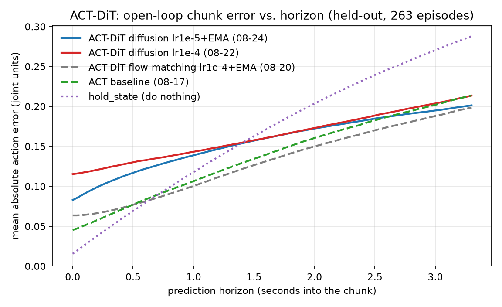

# ACT-DiT 低学习率复训：编码器救回来了，但换成 diffusion 目标把收益吃光了

**被评 checkpoint** `/mnt/robot_platform/jobs/act_dit_tidy_up_stationery_le_batch_success_361_2026-08-24_06-21-05-197422/run/checkpoints/{050000,100000,150000,200000}/pretrained_model`
**Policy** `act_dit` — `objective: diffusion`（DDIM，`num_train_timesteps` 100，`prediction_type` epsilon，`num_inference_steps` 10），`chunk_size` 100，`use_vae` false，`use_ema` true（decay 0.9999），`use_cross_attention` true，ResNet18，200 000 步，**常数 LR 1e-5**，无 scheduler
**训练集** `tidy_up_stationery_le/batch_success_361`（363 episodes，`dataset_episodes: null` — 全部用于训练，仍然没有留出验证集）
**上一篇** [`act_dit-encoder-collapse-2026-08.md`](act_dit-encoder-collapse-2026-08.md)。本次训练执行的正是它 §1 开的处方：把 `optimizer_lr` 从 1e-4 降回 1e-5。
**测量日期** 2026-08-27，mgmt01（RTX 4090），`lerobot` conda env + `PYTHONPATH=/home/kewei/YING/lerobot_vlahost/src`
**脚本与原始数据** [`../test_scripts/scripts_act_dit_lowlr/`](../test_scripts/scripts_act_dit_lowlr/)

---

## 1. 结论

**处方生效了，但这次实验同时动了三个变量，其中一个把收益全部抵消。**

1. **编码器活着。** 最后一层 encoder 的输出 LayerNorm 增益是 **0.973**（塌掉的那版是 0.113），
   图像敏感度 **2.2e-2**（塌掉的那版是 3e-6，差 7000 倍），已经进到 ACT baseline
   （5.0e-2）的同一个数量级。换掉三路相机图像，发出的 chunk 移动 **27%** 的帧间自然差异
   ——上一版是 **0**（字面意义的 0，不是"接近 0"）。**"结构上不可能看图"这条已经不成立了。**
   而且这个比例**随训练单调上升**（50k 18.0% → 200k 27.1%），方向和塌缩期正好相反。

2. **但离线动作精度全线变差。** held-out 263 个 episode 上 MAE 0.1545，只比"原地不动"好
   **6%**；上一版 flow matching 是 0.1289（好 27%），ACT baseline 是 0.1355（好 21%）。
   训练集内更明显：0.0954，而 flow matching 是 0.0370，ACT 是 0.0125。

3. **拆开变量后，两个方向都很干净（§4）。** 在**同一个 diffusion 目标**下，把 LR 从 1e-4
   降到 1e-5：训练集内 0.1275 → 0.0954（改善 25%），held-out 0.1618 → 0.1545，编码器从
   全塌变成活着。**LR 修复本身是纯收益，和上一篇的预测一致。**
   把目标从 flow matching 换成 diffusion（同为 200k 步）：训练集内 0.0370 → 0.0954
   （劣化 2.6 倍）。**回归来自 objective，不来自 LR。**

4. **第一帧偏差没修好，而且这次连"多采样几步"都会让它更糟（§5）。** held-out 第一帧
   0.0828 rad，比"原地不动"的 0.0156 差 5.3 倍（上一版是差 4.1 倍）。DDIM 推理步数
   10 → 50 让 mae@1 **上升** 24%（0.0911 → 0.1128）；8 次采样取均值只降 1.8%。
   和上一篇一样，这是系统性偏差，不是采样噪声。

**一句话**：这次训练证明了低 LR 能救编码器，但 `objective: diffusion` 在这个数据集上比
flow matching 差一个身位。下一次重训应该是 **flow matching + lr 1e-5 + EMA**，也就是只
保留处方本身。

---

## 2. 编码器体检：塌缩解除

`probe_encoder_collapse.py`，逐层报告 post-norm 编码器的输出增益 `norm2.weight`、
输出幅值，以及换一张完全无关的图时编码器输出的**相对**变化量。
（数据：[`scripts_act_dit_lowlr/enc_lowlr.json`](../test_scripts/scripts_act_dit_lowlr/enc_lowlr.json)）

最后一层（enc3，整条观测通路的总开关）：

| checkpoint | 目标 / LR / EMA | enc3 mean&#124;γ&#124; | enc3 signal | enc3 img-sens |
|---|---|---:|---:|---:|
| **本次 08-24，200k** | diffusion / 1e-5 / 有 | **0.9731** | 0.5162 | **2.19e-2** |
| 08-22，200k | diffusion / 1e-4 / 无 | 0.1132 | 0.0017 | 3.0e-6 |
| 08-20，200k | flow matching / 1e-4 / 有 | 0.1309 | 0.0038 | 2.0e-6 |
| ACT baseline，200k | — / 1e-5 / — | 1.0037 | 0.8142 | 4.99e-2 |

本次 4 个 checkpoint 的走向：

| step | enc0 &#124;γ&#124; | enc3 &#124;γ&#124; | enc3 signal | enc0 img-sens | enc3 img-sens |
|---|---:|---:|---:|---:|---:|
| 50k | 1.0011 | 0.9916 | 0.6910 | 0.1727 | 0.0193 |
| 100k | 1.0034 | 0.9852 | 0.6265 | 0.1482 | 0.0230 |
| 150k | 1.0051 | 0.9789 | 0.5720 | 0.1238 | 0.0257 |
| 200k | 1.0064 | 0.9731 | 0.5162 | 0.0977 | 0.0219 |

γ 在 200k 步里只从 0.992 掉到 0.973，`frac<0.05` 全程为 0——没有任何一个通道被关掉。
对比塌掉的那版，enc3 有 **67.8%** 的通道 |γ| < 0.05。

**保留的一条尾巴**：enc3 的输出幅值仍在缓慢下降（0.691 → 0.516，200k 步里 -25%），
enc0 的图像敏感度也在降（0.173 → 0.098）。塌缩机制没有被消灭，只是被减速到
"200k 步内不会造成危害"的程度。**如果把这个配置训到 500k 步以上，要重新体检。**

---

## 3. 归因：chunk 到底来自哪条路

`probe_conditioning.py`，32 个 anchor，**固定初始噪声**（否则采样方差会盖过一切）。
本次为支持 diffusion 目标补了一条 `ddim_sample` 通路（§7）。
Δ 以"帧间自然差异"（不同 anchor 的 chunk 之间的平均 L1 距离）为单位。

| 扰动 | 08-24 diffusion 1e-5 | 08-22 diffusion 1e-4 | 08-20 flow matching 1e-4 |
|---|---:|---:|---:|
| 换掉全部三路图像 | **27.1%** | 0.0% | 0.0% |
| 换掉 state（两条路） | 36.7% | 54.2% | 51.0% |
| 只换 adaLN 路的 state | 36.6% | 54.2% | 51.0% |
| 只换 encoder token 路的 state | 2.8% | 0.0% | 0.0% |
| state 置零 | 50.0% | 78.3% | 78.9% |

三件事：

- **图像重新有了话语权**：27.1%，且随训练上升（50k 18.0% → 100k 22.4% → 150k 25.3% →
  200k 27.1%）。上一版是 0，而且随训练往 0 走。
- **encoder token 路也活了**：只换 encoder 那一路的 state，chunk 移动 2.8%（上一版 0.0%）。
  这条路和图像共用同一个 encoder，它有反应本身就是编码器没塌的旁证。
- **state 的相对份额下降**：36.7% vs 上一版的 51–54%。观测的两条路在重新分权。

adaLN 条件向量 `[time_mlp(t) | state]` 的两半，量级失衡也大幅收敛：

| checkpoint | contribution_time | contribution_state | time/state |
|---|---:|---:|---:|
| 08-24 diffusion 1e-5 | 64.8 | 21.5 | **3.0×** |
| 08-22 diffusion 1e-4 | 1990.5 | 48.9 | 40.7× |
| 08-20 flow matching 1e-4 | 930.0 | 40.7 | 22.9× |

lr 1e-4 下 time embedding 的幅值失控（比 state 大 20–40 倍），1e-5 下收敛到 3 倍。
（注意：diffusion 的 timestep 是 0–99 的整数，flow matching 是 [0,1] 的实数，
所以 `time_norm` 的绝对值不能跨目标比，比值可以。）

---

## 4. 离线动作精度：修好了编码器，指标反而更差

`offline_chunk_eval.py`，同一套指纹去污染（263 个干净 held-out episode = batch_1 + batch_2
+ batch_3 + batch_4 的 50 个）、同一批 anchor（held-out 8 897 个 / 824 620 个 anchor-step；
训练集内 15 035 个 / 1 413 355 个）、同一个 `hold_state` 空策略基线。
去污染方法和 anchor 定义见 [`../test_scripts/scripts_act_eval_test/README.md`](../test_scripts/scripts_act_eval_test/README.md) §2–3。

| checkpoint | 目标 / LR / EMA | 训练集内 MAE | held-out MAE | held-out vs. 空策略 |
|---|---|---:|---:|---:|
| **08-24（本次）** | diffusion / 1e-5 / 有 | 0.0954 | **0.1545** | **1.06×** |
| 08-22 | diffusion / 1e-4 / 无 | 0.1275 | 0.1618 | 1.01× |
| 08-20 | flow matching / 1e-4 / 有 | 0.0370 | 0.1289 | 1.27× |
| ACT baseline | — / 1e-5 / — | 0.0125 | 0.1355 | 1.21× |
| `hold_state`（什么都不做） | — | 0.1506 | 0.1636 | 1.00× |

**08-22 这一行是本次新测的**——它是唯一能把 LR 和 objective 分开的对照（同为 diffusion，
只差 LR 和 EMA）。上一篇没有测过它。有了它，两个变量各自的方向就干净了：

- **LR 1e-4 → 1e-5（objective 固定为 diffusion）**：训练集内 0.1275 → 0.0954（**-25%**），
  held-out 0.1618 → 0.1545（-4.5%），编码器从全塌变成活着。**处方有效。**
  （这一步同时打开了 EMA，所以严格说这里是 LR+EMA 的合并效应。）
- **flow matching → diffusion（LR 固定为 1e-4）**：训练集内 0.0370 → 0.1275（**劣化 3.4 倍**），
  held-out 0.1289 → 0.1618。**这才是回归的来源。**

按 horizon 拆开（held-out，chunk 前 N 帧的 MAE，30 fps）：

| horizon | 1 | 10 | 25 | 50 | 100 |
|---|---:|---:|---:|---:|---:|
| **08-24 diffusion 1e-5** | 0.0828 | 0.0945 | 0.1096 | 0.1281 | 0.1545 |
| 08-22 diffusion 1e-4 | 0.1152 | 0.1192 | 0.1266 | 0.1380 | 0.1618 |
| 08-20 flow matching | 0.0635 | 0.0656 | 0.0741 | 0.0930 | 0.1289 |
| ACT baseline | 0.0453 | 0.0544 | 0.0702 | 0.0944 | 0.1355 |
| `hold_state` | **0.0156** | **0.0320** | **0.0579** | 0.0975 | 0.1636 |



**在真正会被执行的那一段（前 10–25 帧，0.3–0.8 s）上，这个 checkpoint 仍然不如原地不动，
而且比上一版更不如。** 曲线在 1.4 s 处才穿过 `hold_state`。

### 4.1 这是不是"训得不够"？

低 LR 需要更多步数，这是上一篇 §4 已经量过的（同样 loss 要多花 3.5 倍步数）。所以问题是：
再训下去能不能追上 flow matching 的 0.1289？把 4 个 checkpoint 都在 held-out 上评一遍：

| step | held-out MAE | Δ（相对上一个 50k） | vs. 空策略 |
|---|---:|---:|---:|
| 50k | 0.1729 | — | 0.95×（**比不动还差**） |
| 100k | 0.1624 | -0.0105 | 1.01× |
| 150k | 0.1572 | -0.0052 | 1.04× |
| 200k | 0.1545 | -0.0027 | 1.06× |

单调改善，200k 时仍在改善——**但每 50k 的增量恰好在减半**。按这个等比外推，剩余总改善
约 -0.0027，渐近线在 **0.152 附近**，仍然明显差于 flow matching 的 0.1289。
（这是外推，不是测量；要证实需要一次 400k 步的训练。）

**结论：单纯延长这个配置的训练步数，预计追不上 flow matching。**

### 4.2 分 batch 看

| | batch_1 | batch_2 | batch_3 | batch_4(50 ep) |
|---|---:|---:|---:|---:|
| 08-24 diffusion 1e-5 | 0.1711 | 0.1689 | 0.1595 | 0.1156 |
| 08-22 diffusion 1e-4 | 0.1706 | 0.1751 | 0.1663 | 0.1344 |
| `hold_state` | 0.1483 | 0.1643 | 0.1792 | 0.1522 |

`batch_1` 和 `batch_2` 上策略**比原地不动更差**；只有 `batch_4`（和训练集同场次录制的
那 50 个 episode）明显赢。这和 [`act-policy-leans-on-background-pixels`] 记录的
"按场次外观选模式"是同一个症状——编码器修好并没有解决它。

---

## 5. 第一帧偏差：仍在，且 DDIM 步数越多越糟

`sweep_sampling.py`，`batch_3` held-out，300 个 anchor / 28 055 个 anchor-step，
与上一篇 §5 完全相同的配置（两个旋钮都只影响推理，不需要重训）：

| 配置 | mae@1 | mae@10 | mae@100 |
|---|---:|---:|---:|
| `steps=10, samples=1`（当前部署配置） | 0.09111 | 0.10369 | 0.16850 |
| `steps=10, samples=8` | 0.08947 | 0.10228 | 0.16712 |
| `steps=50, samples=1` | **0.11282** | 0.12602 | 0.17942 |
| `steps=50, samples=8` | 0.11108 | 0.12426 | 0.17801 |
| `hold_state`（什么都不做） | **0.02125** | **0.03876** | 0.17042 |

- **推理步数 10 → 50：变差 24%**（0.0911 → 0.1128）。这和 flow matching 那版（10→50 无变化）
  不同，是 diffusion 侧独有的：`num_train_timesteps=100` 的 DDIM 在 `clip_sample=True` 下，
  推理网格加密并不等于更准。**不要调大 `num_inference_steps`。**
- **8 次采样取均值：只降 1.8%**（flow matching 那版是 3.1%）。采样方差最多解释这个误差的 2%。

剩下的 98% 仍然是系统性偏差。**编码器修好了，第一帧偏差没有跟着修好**——这佐证了上一篇
的判断：这是两个独立缺陷，不是一个。

---

## 6. 建议

1. **下一次重训：flow matching + lr 1e-5 + EMA，200k 步起。** 这是唯一还没试过的组合，
   也是把处方和回归分开之后剩下的那一个。已有的四次训练覆盖了
   (fm, 1e-4, 无)、(fm, 1e-4, 有)、(diff, 1e-4, 无)、(diff, 1e-5, 有)，正好缺它。
   **这一格要单变量跑**：不要同时打上一篇 P1 的 `state_in_adaln=False` 补丁。那条问题仍然
   存在（§3 里 adaLN 的 state 占 36.6%，压过图像的 27.1%，encoder token 路只有 2.8%），
   但 lr 1e-5 已经足够守住 200k 步，补丁留作这一轮之后的第二个 arm——判据见上一篇 P1。
2. **不要在这个 checkpoint 上调推理旋钮。** `num_inference_steps` 调大是负收益（-24%），
   采样平均是 +1.8%。
3. **训练集里切出验证集。** 四次训练全都是 `dataset_episodes: null`，每一次都得靠事后
   跑 `offline_chunk_eval.py` 才知道泛化情况。`--dataset.eval_split` 已经在 config 里
   （当前是 0.0）。
4. **部署前先跑两个探针**（各一分钟）：`probe_encoder_collapse.py` 看 enc3 img-sens
   （健康 ≥1e-2，塌缩 ~1e-6），`probe_conditioning.py` 看 `images_swapped`
   （健康 >20%，塌缩 0%）。这两个数比 training loss 有用得多——本次 diffusion 的
   loss（0.015）比 flow matching 的（0.032）低一半，而实际动作精度差 2.6 倍，
   **跨目标的 loss 不可比，不要拿来排序**。
5. **部署侧的滤波 + Hermite 桥接仍然掩盖第一帧偏差**（上一篇 §6）。在第一帧误差降到
   `hold_state` 水平（~0.016 rad）之前，真机表现不能用来判断模型改进。

---

## 7. 本次为支持 diffusion 目标所做的脚本改动

`probe_conditioning.py` 和 `sweep_sampling.py` 原来只写了 flow matching 的路径，直接跑
这个 checkpoint 会静默给出错误结果。改动在
[`scripts_act_dit_probe/`](../test_scripts/scripts_act_dit_probe/) 原地完成（两个脚本都是
共用测量工具，不适合复制一份分叉）：

- `probe_conditioning.py`：新增 `ddim_sample()`——`DiffusionObjective.conditional_sample`
  的复制，但初始噪声由外部提供，这样所有扰动条件共用同一个噪声起点（原来的
  `euler_sample()` 是同样的理由）。新增 `make_sampler()` 按 `cfg.objective` 分派，
  `timestep_probe_values()` 按目标给出各自单位的 4 个时间点（flow matching 用
  [0,1] 的实数，diffusion 用 scheduler 推理网格上的整数）。输出 JSON 增加 `objective` 字段。
  selftest 增加两条断言：`ddim_sample` 对固定 x0 必须确定性，且必须真的用上传入的 x0。
- `sweep_sampling.py`：`--steps` 原来只改 `num_integration_steps`。`DiffusionObjective`
  在 `__init__` 里就把 `num_inference_steps` 缓存到自己身上，只改 config 没有效果——
  现在按目标分派，diffusion 路径同时改 config 和 objective 上的缓存值并断言。

两个脚本的 `--selftest` 都通过。`probe_encoder_collapse.py` 和 `offline_chunk_eval.py`
与目标无关（前者只读权重 + 一次 encoder 前向，后者只调 `predict_action_chunk`），未改动。

**环境**：`act_dit` 只存在于 `lerobot_vlahost` 和 `robot_data_platform/lerobot` 两份代码里，
`lerobot` conda env 自带的 lerobot 没有它，mgmt01 的 `/opt/robot-platform/train-venv`
（8 月 19 日那份）没有 EMA 代码、加载本 checkpoint 会直接失败。所以一律：

```bash
export PYTHONPATH=/home/kewei/YING/lerobot_vlahost/src
conda run -n lerobot python <script> ...
```

本次训练跑在 **gpu04**，用的是那台机器自己的 `train-venv`。`job.sbatch` 里**没有任何
`--policy.*` 覆盖**（`job.json` 的 `config_path` 也是 null），所以三个变量全部来自那份
默认值。实测三份代码的 `ACTDiTConfig` 默认值（2026-08-27）：

| 位置 | objective | optimizer_lr | use_ema |
|---|---|---:|---|
| gpu04 `/opt/robot-platform/train-venv`（训出本 checkpoint 的那份） | `diffusion` | 1e-5 | `True` |
| mgmt01 `/opt/robot-platform/train-venv`（8 月 19 日） | `flow_matching` | 1e-4 | 不存在此字段 |
| `robot_data_platform/lerobot` HEAD | `flow_matching` | 1e-4 | `False` |

（gpu04 一行是 `srun -w gpu04` 直接读该文件确认的，不是从 `config.json` 反推的。）

**这是个隐患：同一条 `lerobot_train` 命令在不同节点会训出不同的模型，事后只能靠
`config.json` 反推。** 建议把关键超参显式写进 sbatch，或者把三份代码对齐。
