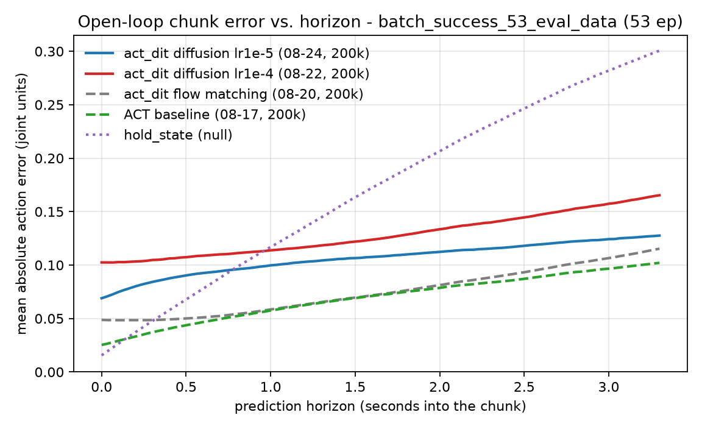

# ACT-DiT 低学习率复训：编码器救回来了，但换成 diffusion 目标把收益吃光了

**被评 checkpoint** `/mnt/robot_platform/jobs/act_dit_tidy_up_stationery_le_batch_success_361_2026-08-24_06-21-05-197422/run/checkpoints/{050000,100000,150000,200000}/pretrained_model`
**Policy** `act_dit` — `objective: diffusion`（DDIM，`num_train_timesteps` 100，`prediction_type` epsilon，`num_inference_steps` 10），`chunk_size` 100，`use_vae` false，`use_ema` true（decay 0.9999），`use_cross_attention` true，ResNet18，200 000 步，**常数 LR 1e-5**，无 scheduler
**训练集** `tidy_up_stationery_le/batch_success_361`（363 episodes，`dataset_episodes: null` — 全部用于训练，仍然没有留出验证集）
**评测集** `tidy_up_stationery_le/batch_success_53_eval_data`（53 episodes，40 132 帧，2026-08-21 录制；指纹比对与训练集 **0 重叠**）
**上一篇** [`act_dit-encoder-collapse-2026-08.md`](act_dit-encoder-collapse-2026-08.md)。本次训练执行的正是它 §1 开的处方：把 `optimizer_lr` 从 1e-4 降回 1e-5。
**测量日期** 2026-08-27，mgmt01（RTX 4090），`lerobot` conda env + `PYTHONPATH=/home/kewei/YING/lerobot_vlahost/src`
**脚本与原始数据** [`../test_scripts/scripts_act_dit_lowlr/`](../test_scripts/scripts_act_dit_lowlr/)

---

## 1. 结论

> **2026-08-27 修订。** 本报告的 held-out 数字原先取自 `batch_1`–`batch_4`（263 ep，
> 2026-08-07…08-12 录制）。现已全部改用指定评测集 `batch_success_53_eval_data`
> （53 ep，2026-08-21 录制）重测，七个 checkpoint 逐个重跑。
> **结论的方向没变**（objective 是回归来源、第一帧偏差仍在、DDIM 步数调大是负收益），
> **但绝对水平变了**：按全 horizon 的 MAE，评测集上三个 act_dit checkpoint 全都明显好于
> "原地不动"（1.3–2.3×），旧集上是 1.0–1.3×；短 horizon（前 10 帧）的结论两边一样，仍然输。
> 两个集之间的落差本身是一条结论，见 §4.3。旧集的数字保留在 §4.3 的表里。

**处方生效了，但这次实验同时动了三个变量，其中一个把收益全部抵消。**

1. **编码器活着。** 最后一层 encoder 的输出 LayerNorm 增益是 **0.973**（塌掉的那版是 0.113），
   图像敏感度 **2.2e-2**（塌掉的那版是 3e-6，差 7000 倍），已经进到 ACT baseline
   （5.0e-2）的同一个数量级。换掉三路相机图像，发出的 chunk 移动 **27%** 的帧间自然差异
   ——上一版是 **0**（字面意义的 0，不是"接近 0"）。**"结构上不可能看图"这条已经不成立了。**
   而且这个比例**随训练单调上升**（50k 18.0% → 200k 27.1%），方向和塌缩期正好相反。

2. **但离线动作精度仍然落后 flow matching 一个身位。** 评测集 53 个 episode 上 MAE
   **0.1056**，比"原地不动"（0.1672）好 **58%**——这一格是及格的。问题在横向比：同一评测集上
   flow matching 是 **0.0743**（好 125%），ACT baseline 是 **0.0685**（好 144%）。
   训练集内同样落后：0.0954，而 flow matching 是 0.0370，ACT 是 0.0125。

3. **拆开变量后，两个方向都很干净（§4）。** 在**同一个 diffusion 目标**下，把 LR 从 1e-4
   降到 1e-5：训练集内 0.1275 → 0.0954（改善 25%），评测集 0.1276 → 0.1056（改善 17%），
   编码器从全塌变成活着。**LR 修复本身是纯收益，和上一篇的预测一致。**
   把目标从 flow matching 换成 diffusion（同为 200k 步）：训练集内 0.0370 → 0.0954
   （劣化 2.6 倍），评测集 0.0743 → 0.1056（劣化 42%）。**回归来自 objective，不来自 LR。**

4. **第一帧偏差没修好，而且这次连"多采样几步"都会让它更糟（§5）。** 评测集第一帧
   **0.0690 rad**，比"原地不动"的 0.0156 差 **4.4 倍**；前 10 帧 0.0771 vs 0.0317，差 2.4 倍。
   曲线要到 **0.80 s** 才穿过 `hold_state`（flow matching 0.33 s，ACT 0.17 s）。
   DDIM 推理步数 10 → 50 让 mae@1 **上升 30%**（0.0706 → 0.0919）；8 次采样取均值只降 1.6%。
   和上一篇一样，这是系统性偏差，不是采样噪声。

**一句话**：这次训练证明了低 LR 能救编码器，但 `objective: diffusion` 在这个数据集上比
flow matching 差一个身位。下一次重训应该是 **flow matching + lr 1e-5 + EMA**，也就是只
保留处方本身。

---

## 2. 编码器体检：塌缩解除

`probe_encoder_collapse.py`，逐层报告 post-norm 编码器的输出增益 `norm2.weight`、
输出幅值，以及换一张完全无关的图时编码器输出的**相对**变化量。
（数据：[`scripts_act_dit_lowlr/enc_lowlr.json`](../test_scripts/scripts_act_dit_lowlr/enc_lowlr.json)）

最后一层（enc3，整条观测通路的总开关）：

| checkpoint | 目标 / LR / EMA | enc3 mean&#124;γ&#124; | enc3 signal | enc3 img-sens |
|---|---|---:|---:|---:|
| **本次 08-24，200k** | diffusion / 1e-5 / 有 | **0.9731** | 0.5162 | **2.19e-2** |
| 08-22，200k | diffusion / 1e-4 / 无 | 0.1132 | 0.0017 | 3.0e-6 |
| 08-20，200k | flow matching / 1e-4 / 有 | 0.1309 | 0.0038 | 2.0e-6 |
| ACT baseline，200k | — / 1e-5 / — | 1.0037 | 0.8142 | 4.99e-2 |

本次 4 个 checkpoint 的走向：

| step | enc0 &#124;γ&#124; | enc3 &#124;γ&#124; | enc3 signal | enc0 img-sens | enc3 img-sens |
|---|---:|---:|---:|---:|---:|
| 50k | 1.0011 | 0.9916 | 0.6910 | 0.1727 | 0.0193 |
| 100k | 1.0034 | 0.9852 | 0.6265 | 0.1482 | 0.0230 |
| 150k | 1.0051 | 0.9789 | 0.5720 | 0.1238 | 0.0257 |
| 200k | 1.0064 | 0.9731 | 0.5162 | 0.0977 | 0.0219 |

γ 在 200k 步里只从 0.992 掉到 0.973，`frac<0.05` 全程为 0——没有任何一个通道被关掉。
对比塌掉的那版，enc3 有 **67.8%** 的通道 |γ| < 0.05。

**保留的一条尾巴**：enc3 的输出幅值仍在缓慢下降（0.691 → 0.516，200k 步里 -25%），
enc0 的图像敏感度也在降（0.173 → 0.098）。塌缩机制没有被消灭，只是被减速到
"200k 步内不会造成危害"的程度。**如果把这个配置训到 500k 步以上，要重新体检。**

---

## 3. 归因：chunk 到底来自哪条路

`probe_conditioning.py`，32 个 anchor，**固定初始噪声**（否则采样方差会盖过一切）。
本次为支持 diffusion 目标补了一条 `ddim_sample` 通路（§7）。
Δ 以"帧间自然差异"（不同 anchor 的 chunk 之间的平均 L1 距离）为单位。

| 扰动 | 08-24 diffusion 1e-5 | 08-22 diffusion 1e-4 | 08-20 flow matching 1e-4 |
|---|---:|---:|---:|
| 换掉全部三路图像 | **27.1%** | 0.0% | 0.0% |
| 换掉 state（两条路） | 36.7% | 54.2% | 51.0% |
| 只换 adaLN 路的 state | 36.6% | 54.2% | 51.0% |
| 只换 encoder token 路的 state | 2.8% | 0.0% | 0.0% |
| state 置零 | 50.0% | 78.3% | 78.9% |

三件事：

- **图像重新有了话语权**：27.1%，且随训练上升（50k 18.0% → 100k 22.4% → 150k 25.3% →
  200k 27.1%）。上一版是 0，而且随训练往 0 走。
- **encoder token 路也活了**：只换 encoder 那一路的 state，chunk 移动 2.8%（上一版 0.0%）。
  这条路和图像共用同一个 encoder，它有反应本身就是编码器没塌的旁证。
- **state 的相对份额下降**：36.7% vs 上一版的 51–54%。观测的两条路在重新分权。

adaLN 条件向量 `[time_mlp(t) | state]` 的两半，量级失衡也大幅收敛：

| checkpoint | contribution_time | contribution_state | time/state |
|---|---:|---:|---:|
| 08-24 diffusion 1e-5 | 64.8 | 21.5 | **3.0×** |
| 08-22 diffusion 1e-4 | 1990.5 | 48.9 | 40.7× |
| 08-20 flow matching 1e-4 | 930.0 | 40.7 | 22.9× |

lr 1e-4 下 time embedding 的幅值失控（比 state 大 20–40 倍），1e-5 下收敛到 3 倍。
（注意：diffusion 的 timestep 是 0–99 的整数，flow matching 是 [0,1] 的实数，
所以 `time_norm` 的绝对值不能跨目标比，比值可以。）

---

## 4. 离线动作精度：修好了编码器，仍然追不上 flow matching

`offline_chunk_eval.py`，评测集 `batch_success_53_eval_data`——53 个 episode、40 132 帧，
2026-08-21 录制，用 action 数组的 SHA-1 指纹对训练集 `batch_success_361` 逐 episode 比对，
**0 个重叠**（不像 `batch_4` 有 38% 落在训练集里，这个集不需要过滤，`--train-root` 跑出来
`episodes_dropped_as_contaminated: 0`）。stride 20 → 2 007 个 anchor / 187 595 个 anchor-step，
所有 checkpoint 共用同一批 anchor 和同一个 `hold_state` 空策略基线。
anchor 与指标定义见 [`../test_scripts/scripts_act_eval_test/README.md`](../test_scripts/scripts_act_eval_test/README.md) §3。
训练集内一列是在 `batch_success_361` 上测的，与评测集无关，沿用 08-27 首测的数字。

| checkpoint | 目标 / LR / EMA | 训练集内 MAE | 评测集 MAE | 评测集 norm. MAE | vs. 空策略 |
|---|---|---:|---:|---:|---:|
| **08-24（本次）** | diffusion / 1e-5 / 有 | 0.0954 | **0.1056** | 0.327 | **1.58×** |
| 08-22 | diffusion / 1e-4 / 无 | 0.1275 | 0.1276 | 0.390 | 1.31× |
| 08-20 | flow matching / 1e-4 / 有 | 0.0370 | **0.0743** | 0.229 | 2.25× |
| ACT baseline | — / 1e-5 / — | 0.0125 | **0.0685** | 0.211 | 2.44× |
| `hold_state`（什么都不做） | — | 0.1506 | 0.1672 | 0.514 | 1.00× |
| `train_mean`（永远输出训练集均值） | — | — | 0.3185 | 0.881 | 0.53× |

**08-22 这一行是本次新测的**——它是唯一能把 LR 和 objective 分开的对照（同为 diffusion，
只差 LR 和 EMA）。有了它，两个变量各自的方向就干净了：

- **LR 1e-4 → 1e-5（objective 固定为 diffusion）**：训练集内 0.1275 → 0.0954（**-25%**），
  评测集 0.1276 → 0.1056（**-17%**），编码器从全塌变成活着。**处方有效**，而且在评测集上
  比在旧 held-out 集上（-4.5%）明显得多。
  （这一步同时打开了 EMA，所以严格说这里是 LR+EMA 的合并效应。）
- **flow matching → diffusion（LR 固定为 1e-4）**：训练集内 0.0370 → 0.1275（**劣化 3.4 倍**），
  评测集 0.0743 → 0.1276（**劣化 72%**）。**这才是回归的来源。**
- 即使打上处方，diffusion 的 0.1056 仍然比未打处方的 flow matching 的 0.0743 差 42%。
  **LR 修复挽回的量小于 objective 换错丢掉的量。**

按 horizon 拆开（评测集，chunk 前 N 帧的 MAE，30 fps）：

| horizon | 1 | 10 | 25 | 50 | 100 | 穿过 `hold_state` |
|---|---:|---:|---:|---:|---:|---|
| **08-24 diffusion 1e-5** | 0.0690 | 0.0771 | 0.0856 | 0.0941 | **0.1056** | 第 24 帧（0.80 s） |
| 08-22 diffusion 1e-4 | 0.1025 | 0.1032 | 0.1062 | 0.1117 | 0.1276 | 第 29 帧（0.97 s） |
| 08-20 flow matching | 0.0487 | 0.0485 | 0.0500 | 0.0567 | 0.0743 | 第 10 帧（0.33 s） |
| ACT baseline | 0.0253 | 0.0312 | 0.0397 | 0.0511 | 0.0685 | 第 5 帧（0.17 s） |
| `hold_state` | **0.0156** | **0.0317** | 0.0572 | 0.0970 | 0.1672 | — |



**在真正会被执行的那一段（前 10 帧，0.33 s）上，这个 checkpoint 仍然不如原地不动**——
0.0771 vs 0.0317，差 2.4 倍。全 horizon 的胜负（1.58×）全部来自后 2/3 段，
而那一段在闭环里根本不会被执行完。ACT 在 mae@10 上是 0.0312 vs 0.0317，**刚好打平**；
flow matching 是 0.0485，差 1.5 倍。**没有一个 checkpoint 在短 horizon 上真正赢过空策略。**

### 4.1 这是不是"训得不够"？

低 LR 需要更多步数，这是上一篇 §4 已经量过的（同样 loss 要多花 3.5 倍步数）。所以问题是：
再训下去能不能追上 flow matching 的 0.0743？把 4 个 checkpoint 都在评测集上评一遍：

| step | 评测集 MAE | Δ（相对上一个 50k） | mae@10 | vs. 空策略 |
|---|---:|---:|---:|---:|
| 50k | 0.1259 | — | 0.0878 | 1.33× |
| 100k | 0.1135 | -0.0124 | 0.0804 | 1.47× |
| 150k | 0.1084 | -0.0051 | 0.0785 | 1.54× |
| 200k | 0.1056 | -0.0029 | 0.0771 | 1.58× |

单调改善，200k 时仍在改善——**但每 50k 的增量在减半**（-0.0124 → -0.0051 → -0.0029）。
按这个等比外推，剩余总改善约 -0.003，渐近线在 **0.103 附近**，仍然明显差于 flow matching
的 0.0743。（这是外推，不是测量；要证实需要一次 400k 步的训练。）
换集没有改变这条曲线的形状：旧集上 50k → 200k 走了 0.0184，评测集上走了 0.0203，
两边都是单调下降 + 增量减半。

**结论：单纯延长这个配置的训练步数，预计追不上 flow matching。**

### 4.2 逐关节

评测集上 08-24 checkpoint 的 `norm_mae_per_joint`（除以训练集该关节的 action std，
见 [`eval53_lowlr_200000.json`](../test_scripts/scripts_act_dit_lowlr/eval53_lowlr_200000.json)）：

| 最差 4 个 | | 最好 4 个 | |
|---|---:|---|---:|
| `Joint6_L` | 0.554 | `gripper_R` | 0.095 |
| `Joint6_R` | 0.442 | `gripper_L` | 0.141 |
| `Joint2_R` | 0.440 | `Joint5_R` | 0.176 |
| `Joint7_R` | 0.427 | `Joint5_L` | 0.239 |

**两个夹爪是全身最准的两个自由度**（0.095 / 0.141），误差集中在腕部 `Joint6`。
换集之后每个关节都变好，但不是等比：`Joint5_L`（2.5×）、`gripper_L`（2.3×）、
`gripper_R`（2.2×）改善最多，`Joint6_L`（0.98×）、`Joint3_R`（0.99×）几乎没变。
两个集之间逐关节排序的 Spearman 只有 **0.56**——换场次改变的不只是总体水平，
还改变了哪几个关节难。

### 4.3 为什么和旧 held-out 集差这么多

同样 4 个配置（本次共重跑 7 个 checkpoint，含 §4.1 的三个中间步），两套 held-out 数据：

| checkpoint | 旧集 `batch_1`–`batch_4`（263 ep，08-07…08-12） | 评测集 `batch_success_53_eval_data`（53 ep，08-21） | 比值 |
|---|---:|---:|---:|
| 08-24 diffusion 1e-5 | 0.1545（1.06×） | 0.1056（1.58×） | 1.46 |
| 08-22 diffusion 1e-4 | 0.1618（1.01×） | 0.1276（1.31×） | 1.27 |
| 08-20 flow matching | 0.1289（1.27×） | 0.0743（2.25×） | 1.73 |
| ACT baseline | 0.1355（1.21×） | 0.0685（2.44×） | 1.98 |
| `hold_state` | 0.1636 | 0.1672 | 0.98 |

**关键一行是最后一行**：空策略在两个集上几乎一样（0.1636 vs 0.1672，差 2%）。
也就是说两个集的动作幅度、任务节奏是可比的，**评测集并不是一个"动得少所以好做"的集**。
可学习的策略却在评测集上一律好 1.3–2.0 倍。这个落差只能归到分布距离上：

- 录制时间（从各集的 `conversion_manifest.json` 逐 episode 读出）：旧集是 08-07 / 08-11 /
  08-11 / 08-12 四场；训练集 `batch_success_361` = `batch_7`（08-12…08-14，163 ep）+
  `batch_8`（08-17，200 ep）；评测集是 08-21 一场。**旧集全部早于训练集，评测集晚于训练集
  4 天**，时间上紧邻占训练集 55% 的 `batch_8`。
- 这与 [`act-policy-leans-on-background-pixels`] 记录的"按场次外观选模式"一致：
  策略的表现对**录制场次**的敏感度，高于对任务本身的敏感度。
  （时间邻近本身不是原因，场景/光照/物体摆放才是；这里只能证明存在一个按场次划分的落差，
  没有单独控制过任何一个视觉因素。）
- **三个 act_dit 配置的相对排序在两个集上完全一致**（fm < diff-1e-5 < diff-1e-4，越小越好），
  所以本报告用来分离 LR 与 objective 的那些结论不受换集影响。
  **换集确实改变了一处排序**：ACT 与 flow matching 互换——旧集上 fm 0.1289 略优于 ACT 0.1355，
  评测集上 ACT 0.0685 略优于 fm 0.0743。两处差距都在 5% 以内，
  "换掉解码器没有改变泛化能力"这个结论两边都成立。

**哪个数字该用于判断部署？** 评测集这一套。它和真机部署时的场景一致，而旧集只回答
"能不能迁移到更早的场次"。旧集的数字仍然有用——它把"按场次外观选模式"这个缺陷量化了出来：
同一个 checkpoint 换到更早的场次，误差涨 **27%（diff-1e-4）到 98%（ACT）**，
而且**模型越强、掉得越多**——ACT 和 flow matching 这两个在评测集上最好的，
恰好是换场次损失最大的两个。

---

## 5. 第一帧偏差：仍在，且 DDIM 步数越多越糟

`sweep_sampling.py`，评测集 `batch_success_53_eval_data`，stride 100 → 402 个 anchor /
37 659 个 anchor-step。两个旋钮都只影响推理，不需要重训：

| 配置 | mae@1 | mae@10 | mae@100 |
|---|---:|---:|---:|
| `steps=10, samples=1`（当前部署配置） | 0.07060 | 0.07882 | 0.10507 |
| `steps=10, samples=8` | **0.06947** | **0.07757** | **0.10371** |
| `steps=50, samples=1` | 0.09188 | 0.10234 | 0.12664 |
| `steps=50, samples=8` | 0.09044 | 0.10021 | 0.12511 |
| `hold_state`（什么都不做） | **0.01523** | **0.03060** | 0.16744 |

- **推理步数 10 → 50：变差 30%**（0.0706 → 0.0919）。这和 flow matching 那版（10→50 无变化）
  不同，是 diffusion 侧独有的：`num_train_timesteps=100` 的 DDIM 在 `clip_sample=True` 下，
  推理网格加密并不等于更准。**不要调大 `num_inference_steps`。**
  （旧 held-out 集上是 +24%，方向和量级一致，换集没有改变这个结论。）
- **8 次采样取均值：只降 1.6%**（flow matching 那版是 3.1%）。采样方差最多解释这个误差的 2%。

剩下的 98% 仍然是系统性偏差：第一帧 0.0706 rad，比"原地不动"的 0.0152 差 **4.6 倍**。
**编码器修好了，第一帧偏差没有跟着修好**——这佐证了上一篇的判断：这是两个独立缺陷，不是一个。
注意这一段的 mae@1 与 §4 的 0.0690 略有出入（不同 stride、不同 anchor 数），量级一致。

---

## 6. 建议

1. **下一次重训：flow matching + lr 1e-5 + EMA，200k 步起。** 这是唯一还没试过的组合，
   也是把处方和回归分开之后剩下的那一个。已有的四次训练覆盖了
   (fm, 1e-4, 无)、(fm, 1e-4, 有)、(diff, 1e-4, 无)、(diff, 1e-5, 有)，正好缺它。
   **这一格要单变量跑**：不要同时打上一篇 P1 的 `state_in_adaln=False` 补丁。那条问题仍然
   存在（§3 里 adaLN 的 state 占 36.6%，压过图像的 27.1%，encoder token 路只有 2.8%），
   但 lr 1e-5 已经足够守住 200k 步，补丁留作这一轮之后的第二个 arm——判据见上一篇 P1。
2. **不要在这个 checkpoint 上调推理旋钮。** `num_inference_steps` 调大是负收益（-30%），
   采样平均是 +1.6%。
3. **训练集里切出验证集，并把 `batch_success_53_eval_data` 固定为唯一的离线评测集。**
   四次训练全都是 `dataset_episodes: null`，每一次都得靠事后跑 `offline_chunk_eval.py`
   才知道泛化情况。`--dataset.eval_split` 已经在 config 里（当前是 0.0）。
   另外：**不要再混用不同的 held-out 集**。§4.3 已经量出来，同一个 checkpoint 换个录制场次
   MAE 相差 27–98%，而且落差本身与模型强弱相关——跨报告比较用不同的集会排出不同的名次。
4. **部署前先跑两个探针**（各一分钟）：`probe_encoder_collapse.py` 看 enc3 img-sens
   （健康 ≥1e-2，塌缩 ~1e-6），`probe_conditioning.py` 看 `images_swapped`
   （健康 >20%，塌缩 0%）。这两个数比 training loss 有用得多——本次 diffusion 的
   loss（0.015）比 flow matching 的（0.032）低一半，而实际动作精度差 42%（评测集）/
   2.6 倍（训练集内），**跨目标的 loss 不可比，不要拿来排序**。
5. **部署侧的滤波 + Hermite 桥接仍然掩盖第一帧偏差**（上一篇 §6）。在第一帧误差降到
   `hold_state` 水平（~0.015 rad）之前，真机表现不能用来判断模型改进。
   验收线因此写成：**评测集 `mae@10` 必须低于 `hold_state` 的 0.0317**。目前
   ACT 0.0312（刚好打平）、flow matching 0.0485、本 checkpoint 0.0771——三个都没真正过线。

---

## 7. 本次为支持 diffusion 目标所做的脚本改动

`probe_conditioning.py` 和 `sweep_sampling.py` 原来只写了 flow matching 的路径，直接跑
这个 checkpoint 会静默给出错误结果。改动在
[`scripts_act_dit_probe/`](../test_scripts/scripts_act_dit_probe/) 原地完成（两个脚本都是
共用测量工具，不适合复制一份分叉）：

- `probe_conditioning.py`：新增 `ddim_sample()`——`DiffusionObjective.conditional_sample`
  的复制，但初始噪声由外部提供，这样所有扰动条件共用同一个噪声起点（原来的
  `euler_sample()` 是同样的理由）。新增 `make_sampler()` 按 `cfg.objective` 分派，
  `timestep_probe_values()` 按目标给出各自单位的 4 个时间点（flow matching 用
  [0,1] 的实数，diffusion 用 scheduler 推理网格上的整数）。输出 JSON 增加 `objective` 字段。
  selftest 增加两条断言：`ddim_sample` 对固定 x0 必须确定性，且必须真的用上传入的 x0。
- `sweep_sampling.py`：`--steps` 原来只改 `num_integration_steps`。`DiffusionObjective`
  在 `__init__` 里就把 `num_inference_steps` 缓存到自己身上，只改 config 没有效果——
  现在按目标分派，diffusion 路径同时改 config 和 objective 上的缓存值并断言。

两个脚本的 `--selftest` 都通过。`probe_encoder_collapse.py` 和 `offline_chunk_eval.py`
与目标无关（前者只读权重 + 一次 encoder 前向，后者只调 `predict_action_chunk`），未改动。

**环境**：`act_dit` 只存在于 `lerobot_vlahost` 和 `robot_data_platform/lerobot` 两份代码里，
`lerobot` conda env 自带的 lerobot 没有它，mgmt01 的 `/opt/robot-platform/train-venv`
（8 月 19 日那份）没有 EMA 代码、加载本 checkpoint 会直接失败。所以一律：

```bash
export PYTHONPATH=/home/kewei/YING/lerobot_vlahost/src
conda run -n lerobot python <script> ...
```

本次训练跑在 **gpu04**，用的是那台机器自己的 `train-venv`。`job.sbatch` 里**没有任何
`--policy.*` 覆盖**（`job.json` 的 `config_path` 也是 null），所以三个变量全部来自那份
默认值。实测三份代码的 `ACTDiTConfig` 默认值（2026-08-27）：

| 位置 | objective | optimizer_lr | use_ema |
|---|---|---:|---|
| gpu04 `/opt/robot-platform/train-venv`（训出本 checkpoint 的那份） | `diffusion` | 1e-5 | `True` |
| mgmt01 `/opt/robot-platform/train-venv`（8 月 19 日） | `flow_matching` | 1e-4 | 不存在此字段 |
| `robot_data_platform/lerobot` HEAD | `flow_matching` | 1e-4 | `False` |

（gpu04 一行是 `srun -w gpu04` 直接读该文件确认的，不是从 `config.json` 反推的。）

**这是个隐患：同一条 `lerobot_train` 命令在不同节点会训出不同的模型，事后只能靠
`config.json` 反推。** 建议把关键超参显式写进 sbatch，或者把三份代码对齐。
