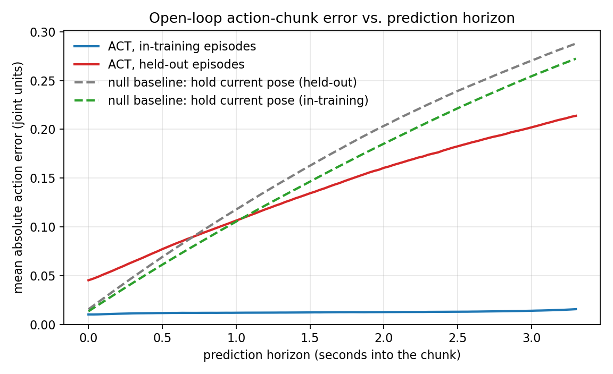

# Offline evaluation of the ACT baseline checkpoint on held-out episodes

**Checkpoint** `/mnt/robot_platform/jobs/act_tidy_up_stationery_le_batch_success_361_2026-08-17_12-42-42-097328/run/checkpoints/200000/pretrained_model`
**Policy** `act` — chunk_size 100, n_action_steps 100, n_obs_steps 1, `use_vae=true`, `kl_weight=10.0`, `temporal_ensemble_coeff=null`, ResNet18 backbone, 200 000 steps at a constant LR of 1e-5
**Training set** `tidy_up_stationery_le/batch_success_361` (363 episodes, 300 689 frames)
**Final training loss** 0.042 (step 200 000)
**Evaluated** 2026-08-21 on mgmt01 (RTX 4090) with `/opt/robot-platform/train-venv`, the interpreter that trained the checkpoint
**Artifacts** `heldout_clean.json`, `intrain_control.json`, `within_session_control_batch4_seen.json`, `horizon_curve.png`, `heldout_batch1-6.json` (superseded, see §2)

---

## 1. Headline result

| condition | anchors | policy MAE | null-baseline MAE | policy vs. null | norm. MAE |
|---|---:|---:|---:|---:|---:|
| **in-training** (`batch_success_361`) | 15 035 | **0.0125** | 0.1506 | **12.0× better** | 0.038 |
| **held-out** (`batch_1–4`, contamination-filtered) | 8 897 | **0.1355** | 0.1636 | **1.21× better** | 0.416 |

MAE is the mean absolute error, in raw joint units, between the 100-step action chunk the policy
emits from a single observation and the demonstrated action. The null baseline is `hold_state` —
emit the currently measured joint pose for the whole chunk, i.e. "do nothing".

**The checkpoint degrades 10.8× on episodes it did not train on, and on those episodes it is only
21 % better than doing nothing.** Its in-training normalised MAE of 0.038 closely tracks the 0.042
training loss the run logged, which is the check that the measurement chain is sound (§4).

The steep, early-plateauing training curve flagged in `../../warmup_and_loss_curve_audit.md` is
therefore not benign for this checkpoint. It is memorisation.

---

## 2. What is actually held out — a correction

The held-out set is **not** `batch_1`–`batch_6`. An earlier claim in
`../../warmup_and_loss_curve_audit.md` rested on matching episode-length sequences, which said
`batch_success_361 = batch_7 + batch_8` (163 + 200 = 363). That arithmetic is right but the
inference from it was wrong: these batch directories are **cumulative merges**, so `batch_7`
itself already contains the earlier batches' episodes.

Fingerprinting every episode by the SHA-1 of its raw `action` array — the only conclusive test —
gives:

| dataset | episodes | exact matches inside `batch_success_361` | usable as held-out |
|---|---:|---:|---|
| `batch_1` | 63 | 0 (0 %) | yes, all 63 |
| `batch_2` | 30 | 0 (0 %) | yes, all 30 |
| `batch_3` | 120 | 0 (0 %) | yes, all 120 |
| `batch_4` | 80 | 30 (38 %) | yes, 50 of 80 |
| `batch_5` | 30 | 30 (100 %) | **no — entirely training data** |
| `batch_6` | 61 | 61 (100 %) | **no — entirely training data** |
| `batch_7` | 163 | 163 (100 %) | no |
| `batch_8` | 200 | 200 (100 %) | no |

The clean held-out set is **263 episodes** (`batch_1` + `batch_2` + `batch_3` + 50 of `batch_4`).

This mattered a great deal. The unfiltered first pass (`heldout_batch1-6.json`, kept for the
record) reported an aggregate policy MAE of 0.0845, because `batch_5` and `batch_6` scored 0.012 —
exactly the in-training figure, since that is what they are. Filtering moves the honest number to
0.1355, a 60 % worse result. `offline_chunk_eval.py --train-root` now performs this filter
automatically and refuses to silently score contaminated episodes.

---

## 3. Method

### 3.1 What is measured

For every sampled anchor frame *t* of a held-out episode:

1. **Build the observation exactly as training did.** The `delta_timestamps` come from
   `resolve_delta_timestamps(cfg, meta)` — the same helper `lerobot_train.py` calls — so the batch
   layout is bit-for-bit what the model saw in training. `uint8` camera frames are scaled to
   `[0,1]` before normalisation, mirroring the eval path at `lerobot_train.py:623`.
2. **Normalise with the checkpoint's own preprocessor.** The statistics are loaded from
   `policy_preprocessor_step_3_normalizer_processor.safetensors`, so they are the *training-set*
   mean/std. Recomputing them on the eval set would leak eval statistics into the model's inputs
   and flatter the result; using the training statistics is also what deployment does.
3. **Emit the chunk.** `policy.predict_action_chunk(batch)` returns the full 100-step chunk from
   that single observation — open loop, no ground truth fed back at any point.
4. **Un-normalise** with the checkpoint's postprocessor, giving raw joint units.
5. **Compare** against the recorded action at *t … t+99*, masking every step that
   `action_is_pad` marks as past the end of the episode.

Ground truth and observed state are snapshotted **before** the preprocessor runs, because the
normaliser rewrites `batch["action"]` in place.

Anchors are every 20th frame (`--stride 20`), which gives 8 897 anchors / 824 620 scored
action-steps on the held-out set and 15 035 anchors / 1 413 355 action-steps in-training.

### 3.2 Why chunk error rather than the training loss

The five candidate policies optimise different objectives — ACT's L1+KL, `act_dit`'s
velocity-MSE, `patch_policy`'s epsilon-MSE. Those losses are different quantities on different
scales and cannot rank the policies against each other. The error between *the action a policy
actually emits* and the demonstrated action is defined identically for all of them, so the same
script and the same number will work for the remaining four checkpoints.

### 3.3 Baselines

An absolute error in radians means nothing on its own, so two reference predictors are scored on
**exactly the same anchors and the same padding mask**:

- **`hold_state`** — emit the current measured joint pose for all 100 steps. In this profile
  `observation.state` and `action` share an identical 16-joint layout (7 left + 7 right + 2
  grippers), so this is the honest null policy: "hold the current pose". A policy that cannot beat
  it has not learned the task, whatever its training loss did.
- **`train_mean`** — emit the training-set mean action. Held-out MAE 0.309; both the policy and
  `hold_state` beat it comfortably, so it only bounds the trivial end of the scale.

### 3.4 Controls

**Positive control.** The same harness on the training set must reproduce the training loss. It
does: in-training normalised MAE 0.038 against a logged final loss of 0.042. ACT in eval mode
uses a zero VAE latent (`modeling_act.py:399`), so `predict_action_chunk` and `forward()` share
one forward pass and the normalised MAE *is* the eval-mode L1 — the number `eval_steps` would have
logged had it been enabled. Without this control a broken harness would be indistinguishable from
a badly generalising policy.

**Within-session control.** `batch_4` splits into 30 episodes that are in the training set and 50
that are not, recorded in the same batch. Scoring the two halves separately holds session,
lighting and object layout fixed, so the difference between them is memorisation with distribution
shift largely removed:

| `batch_4` half | episodes | policy MAE | `hold_state` MAE | vs. null |
|---|---:|---:|---:|---:|
| seen in training | 30 | 0.0120 | 0.1122 | 9.3× better |
| never trained on | 50 | 0.0901 | 0.1522 | 1.7× better |

**7.5× degradation inside one recording batch.** This is the load-bearing result of the report:
the generalisation gap is not mostly an artefact of `batch_1`–`batch_3` being older recordings.

**Self-check.** The error accumulator — the only non-trivial logic in the harness — is verified
against hand-computed values on every run (`selftest()`), including that padded steps contribute
to neither the sum nor the count, and that batched accumulation equals single-batch accumulation.

---

## 4. Detailed results

### 4.1 Error vs. prediction horizon



| horizon cut | in-training policy | held-out policy | held-out null | policy ÷ null |
|---|---:|---:|---:|---:|
| step 1 (executed now) | 0.0103 | 0.0453 | 0.0156 | **0.34× (policy worse)** |
| steps 1–10 (0.33 s) | 0.0108 | 0.0544 | 0.0320 | 0.59× (worse) |
| steps 1–25 (0.83 s) | 0.0114 | 0.0702 | 0.0579 | 0.82× (worse) |
| steps 1–50 (1.67 s) | 0.0118 | 0.0944 | 0.0975 | 1.03× (parity) |
| steps 1–100 (3.33 s) | 0.0125 | 0.1355 | 0.1636 | 1.21× (better) |

The in-training curve is essentially flat — 0.0103 at the first step, 0.0157 at the hundredth,
across 3.3 seconds of open-loop prediction. That flatness is itself the signature of memorisation:
a policy that had learned dynamics would accumulate error with horizon, as the held-out curve does.

On held-out data the policy is **2.9× worse than doing nothing at the first step** and only
overtakes the null baseline past ~1 second. Its apparent full-horizon advantage is largely not the
policy improving but `hold_state` degrading — the demonstrated pose drifts further from the frozen
starting pose as the horizon grows. This matters because `n_action_steps=100` with
`temporal_ensemble_coeff=null` means the whole chunk is executed open loop before replanning, so
the long-horizon region is genuinely used. (Note also the separate finding that the deployed
client resamples the chunk into a Hermite S-curve, so on-robot behaviour is a further step removed
from these numbers.)

### 4.2 Per-joint breakdown

MAE in raw joint units, full horizon.

| joint | in-training | held-out | held-out null | degradation | beats null? |
|---|---:|---:|---:|---:|:--:|
| Joint1_L | 0.0120 | 0.1650 | 0.1893 | 13.7× | yes |
| Joint2_L | 0.0058 | 0.0580 | 0.0589 | 10.0× | marginal |
| Joint3_L | 0.0090 | 0.1087 | 0.1275 | 12.1× | yes |
| Joint4_L | 0.0096 | 0.1029 | 0.1073 | 10.8× | marginal |
| Joint5_L | 0.0122 | 0.1553 | 0.1722 | 12.7× | yes |
| Joint6_L | 0.0123 | 0.1350 | 0.1217 | 11.0× | **no** |
| Joint7_L | 0.0174 | 0.1928 | 0.2532 | 11.1× | yes |
| Joint1_R | 0.0148 | 0.1566 | 0.2025 | 10.6× | yes |
| Joint2_R | 0.0092 | 0.0940 | 0.1496 | 10.3× | yes |
| Joint3_R | 0.0107 | 0.0768 | 0.0989 | 7.2× | yes |
| Joint4_R | 0.0169 | 0.1774 | 0.2553 | 10.5× | yes |
| Joint5_R | 0.0198 | 0.1693 | 0.2438 | 8.6× | yes |
| Joint6_R | 0.0170 | 0.2046 | 0.2050 | 12.0× | marginal |
| Joint7_R | 0.0189 | 0.1715 | 0.1202 | 9.1× | **no** |
| gripper_L | 0.0076 | 0.1172 | 0.1545 | 15.4× | yes |
| gripper_R | 0.0072 | 0.0836 | 0.1578 | 11.5× | yes |

Degradation is remarkably uniform (7.2×–15.4×) across all sixteen joints, which points to a global
failure to generalise rather than one badly-fit degree of freedom. Two wrist joints (`Joint6_L`,
`Joint7_R`) are worse than the null baseline outright, and three more are within 5 % of it.

### 4.3 Per-dataset

| dataset | episodes scored | dropped as contaminated | policy MAE | null MAE |
|---|---:|---:|---:|---:|
| `batch_1` | 63 | 0 | 0.1562 | 0.1483 |
| `batch_2` | 30 | 0 | 0.1447 | 0.1643 |
| `batch_3` | 120 | 0 | 0.1430 | 0.1793 |
| `batch_4` | 50 | 30 | 0.0901 | 0.1522 |
| `batch_5` | — | 30 (all) | skipped | — |
| `batch_6` | — | 61 (all) | skipped | — |

`batch_1` is the only dataset where the policy loses to the null baseline outright. `batch_4`'s
unseen half is the best held-out result, consistent with it being the recording session closest in
time to the training data.

---

## 5. Limitations

- **Offline action error is not task success.** It measures agreement with one demonstrated
  trajectory. A policy taking a different but valid route to the goal is penalised, and one that
  tracks the demonstration but fails at contact is not. These numbers rank checkpoints and detect
  memorisation; they do not predict on-robot success rate, which still requires robot trials.
- **The held-out batches are older recording sessions**, so `batch_1`–`batch_3` carry genuine
  distribution shift on top of the generalisation gap. The `batch_4` within-session control (§3.4)
  is what isolates memorisation, and it still shows 7.5×. Read that control, not the aggregate, as
  the estimate of pure memorisation.
- **One checkpoint only.** This run saved a single checkpoint (step 200 000; `save_freq 9999` did
  not produce retained intermediates), so nothing here says whether an earlier checkpoint would
  generalise better. Given the training loss reached ~97 % of its final drop within one epoch,
  an earlier checkpoint is well worth testing.
- **Stride-20 sampling**, not every frame. With 824 620 scored action-steps the sampling error on
  the aggregate is negligible; per-joint figures are correspondingly solid.
- Anchors near the end of an episode contribute fewer valid horizon steps. This is handled by the
  `action_is_pad` mask and by per-horizon counts, so long-horizon statistics are computed over
  fewer samples but are not biased.

---

## 6. Reproduction

```bash
S=/home/kewei/YING/paper/policy/experiment_report/test_scripts
D=/mnt/robot_platform/datasets/tidy_up_stationery_le
CKPT=/mnt/robot_platform/jobs/act_tidy_up_stationery_le_batch_success_361_2026-08-17_12-42-42-097328/run/checkpoints/last/pretrained_model
PY=/opt/robot-platform/train-venv/bin/python      # the interpreter that trained the checkpoint

ulimit -n "$(ulimit -Hn)"; export LEROBOT_VIDEO_DECODER_CACHE_SIZE=400

# held-out, contamination-filtered  (~55 s)
$PY $S/offline_chunk_eval.py --checkpoint "$CKPT" \
  --train-root $D/batch_success_361 \
  --dataset-root $D/batch_1 --dataset-root $D/batch_2 --dataset-root $D/batch_3 \
  --dataset-root $D/batch_4 --dataset-root $D/batch_5 --dataset-root $D/batch_6 \
  --stride 20 --batch-size 32 --num-workers 8 --out heldout_clean.json

# positive control: the training set itself  (~83 s)
$PY $S/offline_chunk_eval.py --checkpoint "$CKPT" \
  --dataset-root $D/batch_success_361 \
  --stride 20 --batch-size 32 --num-workers 8 --out intrain_control.json

# within-session control: the SEEN half of batch_4  (~11 s)
$PY $S/offline_chunk_eval.py --checkpoint "$CKPT" \
  --train-root $D/batch_success_361 --dataset-root $D/batch_4 \
  --keep-only-contaminated \
  --stride 20 --batch-size 32 --num-workers 8 --out within_session_control_batch4_seen.json

# figure (system python; train-venv has no matplotlib)
/usr/bin/python3 $S/plot_horizon.py --out horizon_curve.png \
  --curve "ACT, in-training episodes" intrain_control.json policy \
  --curve "ACT, held-out episodes" heldout_clean.json policy \
  --curve "null baseline: hold current pose (held-out)" heldout_clean.json hold_state \
  --curve "null baseline: hold current pose (in-training)" intrain_control.json hold_state
```

The harness is policy-agnostic: the same three commands run against the `act_delta`, `act_quality`,
`act_dit`, `patch_policy` and `vita` checkpoints, and `--train-root` must be pointed at whichever
dataset that run actually trained on. `act_quality` and `act_delta` trained on
`batch_success_361_fail_72*` and `batch_7_rel100_keep-gripper` respectively, so their contamination
filters differ from the one used here.
