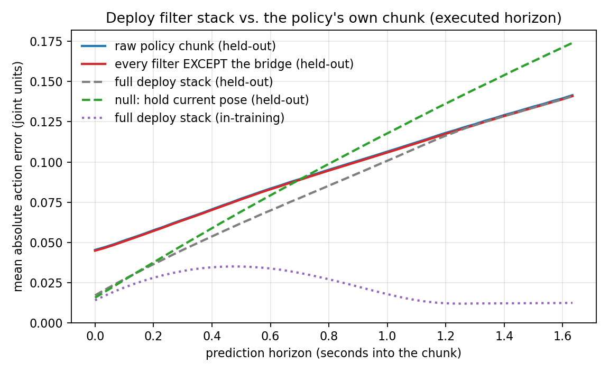

# Deployment-faithful offline evaluation — what changed and why

This directory is a fork of `../scripts_act_eval_test`. Same checkpoint, same datasets, same
contamination filter, same accumulator. The difference is **what gets scored**: the action
sequence the robot is actually commanded to follow, instead of the raw tensor
`predict_action_chunk` returns.

Read `../scripts_act_eval_test/README.md` first for the method and the held-out set
derivation; only the deltas are documented here.

---

## 1. The real inference path, traced end to end

```
deploy.py --config deploy_config_act_dit.yaml
  └─ lerobot-rollout (strategy=base, inference.type=chunk, fps=30)
       ├─ MarvainM6HttpRobot.get_observation()      GET  127.0.0.1:8010/state
       │    ├─ joint_states.positions[14]           radians, passed through unconverted
       │    ├─ gripper_left/right                   raw feedback → gripper_state_calibration → [0,1]
       │    └─ quad_image.stream_url                MJPEG q90 1280x1440 → _split_quad_image()
       │         ├─ top      = rows 0..960, full width, cv2.resize → 640x480  (INTER_AREA)
       │         └─ wrist_L/R = bottom half-tiles, native 640x480
       ├─ ChunkInferenceEngine.get_action_chunk()   fires only when /state says need_new_chunk=1
       │    └─ preprocessor → predict_action_chunk → postprocessor → chunk[:50]
       ├─ core.send_next_action_chunk()             ← THE CHUNK IS REWRITTEN HERE
       │    ├─ remove_small_rollbacks(window=10, max_rollback=2)
       │    ├─ remove_open_gripper_loops(1°..8°, ...)
       │    ├─ smooth_action_chunk(passes=1)        binomial [.25 .5 .25] over 14 arm joints
       │    ├─ smooth_large_excursions(100°)
       │    ├─ cubic_hermite_segment × 14 joints    K=40 bridge, start=MEASURED pose, v0=0
       │    └─ _prepare_action: gripper clip [0,1]
       └─ POST /action_chunk  (50 waypoints)
            └─ vla_node.submit_chunk()              prepends current setpoint, linear-interpolates
                 └─ 500 Hz player → /tj/control/user/joint_cmd_A|B → bringup_all_dm_m696
```

`_check_need_new_chunk()` returns 1 only once the whole 50-waypoint trajectory has been played
(the 200° "reached target" threshold always passes), so the real replan period is
**50 waypoints @ `chunk_waypoint_hz`=30 ≈ 1.67 s**. `inference.chunk_interval_s` in the YAML is
never consulted while the server sends the flag.

## 2. Discrepancies found, and what was done about each

| # | Discrepancy | Impact | Action |
|---|---|---|---|
| 1 | Eval scores all **100** chunk steps; deploy dispatches only the first **50** (`inference.n_action_steps`) and replans | large — the un-executed tail carries most of the reported error | `--n-action-steps 50` (new default), horizon truncated before scoring |
| 2 | Eval scores the **raw** policy chunk; deploy sends a chunk with 4 filters and a **K=40 Hermite bridge** on top — only ~10 of 50 executed steps are unmodified policy output | **largest** — changes the headline number in *both* directions (see §3) | new `policy_deployed` predictor: the real `rollout/trajectory.py` is imported from the deploy checkout by file path and applied per anchor. `--filters` switches individual stages off; `--filter-ablation` attributes the effect per stage (§4) |
| 3 | Gripper targets: deploy clips to [0,1] before the wire | small | included in the rewrite |
| 4 | Deploy's first executed setpoint lags the observation (HTTP round trip + inference + vlahost's prepended blend waypoint) | small, and it moves policy and null together | `--latency-steps N` sensitivity knob, default 0 (see §4) |
| 5 | Head camera: training crops 1280x960 → 640x480 with `INTER_LINEAR` (`profiles/schema.py:CameraTile.apply`, matching `lebot_client._resize_camera`), deploy's `marvain_m6_http._split_quad_image` uses `INTER_AREA` | unknown, plausibly real | **not fixable in the eval** — fix belongs in the deploy splitter. Tile *geometry* was verified identical (2:1 stack, 1280x1440 mosaic preserved by `image_max_width/height`) |
| 6 | Deploy images are JPEG q90 re-encoded by `vla_node._compress_image`; eval images come out of the dataset's video codec | unknown | documented limitation; the dataset has no un-encoded frame to compare against |
| 7 | Gripper `observation.state`: training is a command echo (95 % exactly 0.0/1.0), deploy is real feedback through a two-point calibration eyeballed from one rollout | unknown, off-manifold at intermediate openings | documented limitation; recalibrate on a bench, not from `record_chunk.txt` |
| 8 | `observation.velocity` is declared in both checkpoints' `input_features` but read by neither ACT nor ACT-DiT | none | no action; noted so it stops looking suspicious |
| 9 | `safety_stats_path` / `max_relative_target_deg` are commented out in the deploy YAML, so no action clipping or rate limiting is active | none today | no action; re-check if that config is re-enabled |

Unchanged and verified equivalent: policy loading, `make_pre_post_processors` from the
checkpoint (deploy uses `strategy: base`, so `dataset_stats` is `None` and the checkpoint's own
normaliser is used — same as the eval), `n_obs_steps=1` (no history buffer on either side),
`use_amp=false`, action-key ordering (left arm 7 → right arm 7 → grippers on both sides), arm
units (radians end to end; the deg conversions in `marvain_m6_http` are commented out).

## 3. Result — the rewrite is a regression-to-the-mean filter

ACT baseline, step 200 000, executed horizon 50, stride 20, `--latency-steps 0`.

| condition | `policy_raw` | `policy_deployed` | `hold_state` (null) | deployed vs null |
|---|---:|---:|---:|---:|
| in-training (`batch_success_361`, 15 035 anchors) | 0.0118 | **0.0222** | 0.0873 | 3.9× |
| held-out (`batch_1–4` filtered, 8 897 anchors) | 0.0944 | **0.0839** | 0.0975 | 1.16× |
| `batch_4`, seen half (within-session control) | 0.0110 | 0.0158 | 0.0634 | 4.0× |
| `batch_4`, unseen half | 0.0627 | 0.0589 | 0.0909 | 1.54× |

**The rewrite hurts the policy where it was good and helps it where it was bad.** On training
episodes it nearly doubles the error (0.0118 → 0.0222); on held-out episodes it *lowers* it
(0.0944 → 0.0839), because 40 of the 50 executed steps are a smooth move from the true measured
pose rather than the policy's own opening. Measured at the robot's interface, the
in-training/held-out gap is 3.8×, not the 8.0× the raw chunk shows at the same horizon.

Error vs horizon (raw joint units, MAE up to step *k*):

| cut | in-train raw | in-train deployed | held-out raw | held-out deployed | held-out null |
|---|---:|---:|---:|---:|---:|
| 1 | 0.0103 | 0.0140 | 0.0453 | 0.0170 | 0.0156 |
| 10 | 0.0108 | 0.0243 | 0.0544 | 0.0315 | 0.0320 |
| 25 | 0.0113 | 0.0293 | 0.0702 | 0.0526 | 0.0579 |
| 50 | 0.0118 | 0.0222 | 0.0944 | 0.0839 | 0.0975 |

Inside the bridge (steps 1–25) the deployed command on held-out episodes is statistically
indistinguishable from the null baseline — 0.0170 / 0.0315 / 0.0526 against the null's 0.0156 /
0.0320 / 0.0579. For the first ~1.3 seconds of every chunk the robot is executing a synthetic
S-curve whose only policy content is its endpoint. And on *training* episodes the deployed
command is already no better than doing nothing at the first executed step (0.0140 vs 0.0135).

Whatever the policy has or has not learned, this is what the arm receives.

## 4. Which filter does what (`--filter-ablation`)

The five trajectory filters are applied in a fixed sequence, so each rung of the ladder below
is the previous rung's output plus one more stage — the whole attribution costs one rewrite,
not seven. `filt_4_excursions` is therefore also "everything except the bridge", and
`filt_5_bridge` is the full deploy chunk (`policy_deployed`). Percentages are against
`policy_raw` on the same anchors; negative = closer to the demonstration.

| stage added | in-training MAE | Δ | held-out MAE | Δ | `batch_4` seen | Δ |
|---|---:|---:|---:|---:|---:|---:|
| *(none)* `policy_raw` | 0.01175 | — | 0.09436 | — | 0.01101 | — |
| gripper clip to [0,1] | 0.01159 | −1.4 % | 0.09385 | −0.5 % | 0.01088 | −1.1 % |
| + `remove_small_rollbacks` | 0.01159 | −1.4 % | 0.09386 | −0.5 % | 0.01088 | −1.1 % |
| + `remove_open_gripper_loops` | 0.01159 | −1.3 % | 0.09386 | −0.5 % | 0.01088 | −1.1 % |
| + `smooth_action_chunk` | 0.01156 | −1.6 % | 0.09385 | −0.5 % | 0.01086 | −1.3 % |
| + `smooth_large_excursions` | 0.01156 | −1.6 % | 0.09385 | −0.5 % | 0.01086 | −1.3 % |
| + **K=40 Hermite bridge** (full) | **0.02219** | **+88.8 %** | **0.08393** | **−11.1 %** | **0.01576** | **+43.1 %** |
| bridge alone, no other filter | 0.02242 | +90.8 % | 0.08380 | −11.2 % | 0.01603 | +45.6 % |

**Four of the five filters do essentially nothing.** Rollback removal, gripper-loop removal,
binomial smoothing and excursion linearisation together move the error by less than 0.3 % on
every condition — they fire rarely, and when they fire they change a few steps by a few
milliradians. The gripper clip is a consistent ~1 % improvement, which only says the policy
occasionally overshoots [0, 1] and the clamp is right to exist.



The figure makes the same point per horizon step. The raw chunk (blue) and everything-but-the-
bridge (red) lie on top of each other for all 50 steps — the four filters are invisible at plot
resolution. The full stack (grey) departs from them only inside the bridge and rejoins at
**exactly 1.33 s = K/30**, which is the bridge length, not anything about the policy. The
in-training curve (purple) shows the cost directly: a hump peaking at ~0.03 rad half a second
in, where the S-curve is still catching up to a chunk that was already right, collapsing back
to the raw error the moment the bridge ends.

**The bridge is the entire effect**, and it is not a filter but a replacement: `bridge alone`
lands within 2 % of the full stack in all three conditions, so the other four stages are not
even meaningfully changing what the bridge is handed. On training-like episodes it nearly
doubles the error; on held-out episodes it cuts it by a ninth. That is the signature of
regression to the mean, not of a filter improving a signal.

To reproduce a single variant instead of the ladder, `--filters` takes the same names:

```bash
--filters none                     # policy_deployed == the raw chunk
--filters bridge                   # bridge only
--filters all                      # default: the real deploy stack
--filters rollbacks,smoothing,gripper_clip   # applied in deploy order regardless of typing
```

## 5. Latency sensitivity (`batch_4` unseen half)

| `--latency-steps` | raw | deployed | null | deployed vs null |
|---|---:|---:|---:|---:|
| 0 | 0.0627 | 0.0589 | 0.0909 | 1.54× |
| 2 | 0.0662 | 0.0633 | 0.0969 | 1.53× |
| 5 | 0.0724 | 0.0701 | 0.1057 | 1.51× |

Everything scales together, so mis-estimating the true latency does not change any conclusion.
Left at 0 by default, which keeps the alignment identical to the original harness.

## 6. What this still is not

* **Not a closed-loop rollout.** Every anchor is scored open-loop from a *demonstrated* state.
  On the robot, chunk *N+1* starts wherever chunk *N* actually left the arm, and the Hermite
  bridge re-anchors on that drifted pose. This is a teacher-forced segment evaluation; it
  bounds behaviour, it does not simulate it.
* **Not task success.** Same caveat as the original report: agreement with one demonstrated
  trajectory, not whether the object ends up tidy.
* **Not the deployed observation.** Items 5–7 of §2 are open. The image and gripper-state paths
  differ between training and the robot in ways no offline dataset can reproduce.

## 7. Reproduction

```bash
S=/home/kewei/YING/paper/policy/experiment_report/test_scripts/scripts_act_eval_test_fix
D=/mnt/robot_platform/datasets/tidy_up_stationery_le
CKPT=/mnt/robot_platform/jobs/act_tidy_up_stationery_le_batch_success_361_2026-08-17_12-42-42-097328/run/checkpoints/last/pretrained_model
PY=/opt/robot-platform/train-venv/bin/python

ulimit -n "$(ulimit -Hn)"; export LEROBOT_VIDEO_DECODER_CACHE_SIZE=400
cd $S

# held-out, contamination-filtered  (~70 s)
$PY offline_chunk_eval.py --checkpoint "$CKPT" \
  --train-root $D/batch_success_361 \
  --dataset-root $D/batch_1 --dataset-root $D/batch_2 --dataset-root $D/batch_3 \
  --dataset-root $D/batch_4 --dataset-root $D/batch_5 --dataset-root $D/batch_6 \
  --stride 20 --batch-size 32 --num-workers 8 \
  --n-action-steps 50 --filter-ablation --out heldout_clean_deployed.json

# positive control: the training set itself  (~100 s)
$PY offline_chunk_eval.py --checkpoint "$CKPT" --dataset-root $D/batch_success_361 \
  --stride 20 --batch-size 32 --num-workers 8 \
  --n-action-steps 50 --filter-ablation --out intrain_control_deployed.json

# within-session control: the SEEN half of batch_4  (~10 s)
$PY offline_chunk_eval.py --checkpoint "$CKPT" \
  --train-root $D/batch_success_361 --dataset-root $D/batch_4 --keep-only-contaminated \
  --stride 20 --batch-size 32 --num-workers 8 \
  --n-action-steps 50 --filter-ablation --out within_session_control_batch4_seen_deployed.json

# filter figure (§4)
/usr/bin/python3 ../scripts_act_eval_test/plot_horizon.py --out horizon_filters.png \
  --title "Deploy filter stack vs. the policy's own chunk (executed horizon)" \
  --curve "raw policy chunk (held-out)"                heldout_clean_deployed.json policy_raw \
  --curve "every filter EXCEPT the bridge (held-out)"  heldout_clean_deployed.json filt_4_excursions \
  --curve "full deploy stack (held-out)"               heldout_clean_deployed.json policy_deployed \
  --curve "null: hold current pose (held-out)"         heldout_clean_deployed.json hold_state \
  --curve "full deploy stack (in-training)"            intrain_control_deployed.json policy_deployed
# NB plot_horizon.py cycles through 5 styles; a 6th curve repeats the first colour.

# figures: the plotters in ../scripts_act_eval_test work unchanged.
# plot_horizon.py takes a curve key -- now "policy_raw" / "policy_deployed" instead of "policy".
/usr/bin/python3 ../scripts_act_eval_test/plot_horizon.py --out horizon_curve_deployed.png \
  --curve "ACT raw chunk, held-out"      heldout_clean_deployed.json policy_raw \
  --curve "ACT as deployed, held-out"    heldout_clean_deployed.json policy_deployed \
  --curve "null: hold current pose"      heldout_clean_deployed.json hold_state \
  --curve "ACT as deployed, in-training" intrain_control_deployed.json policy_deployed
# --dump-traces writes both: "pred" is the deployed chunk (what plot_traces.py draws),
# "pred_raw" is the policy's own output.
```

Run any other checkpoint by pointing `--checkpoint` and `--train-root` at it, and set
`--n-action-steps` / `--vlahost-src` to whatever that model's deploy config uses. The
`act_dit` checkpoint deploys with the same 50, so its numbers are directly comparable.

`--selftest` checks the error accumulator (as before) *and* the deploy rewrite: bridge starts at
the measured pose, rejoins the chunk at step K−1, starts with zero velocity, leaves steps past
the bridge alone, clips the grippers, and does not mutate its input. It also checks the filter
selection — that `--filters` ignores the order you type them in, rejects unknown names, that an
empty set returns the policy's own chunk untouched, and that the ablation ladder's 4th rung
really is "everything but the bridge" (the property that lets the ladder share one pass).
All of it runs before every scoring pass.

`--filter-ablation` adds ~35 % wall time (140 s vs 101 s on the 15 035-anchor training set) and
seven accumulators to the JSON; it changes nothing about `policy_raw` or `policy_deployed`.

## 8. Recommended fixes on the deploy side (not done here)

1. `marvain_m6_http._split_quad_image`: `INTER_AREA` → `INTER_LINEAR`, to match
   `lebot_client._resize_camera` and the training conversion. One word.
2. Re-derive `gripper_state_calibration` from a bench measurement instead of one rollout's
   extremes, or record a real gripper feedback topic and retrain with it — the training gripper
   state is a command echo, which is why this mapping is needed at all.
3. Decide whether the K=40 bridge should stay, and consider dropping the other four filters.
   §4 shows the bridge is doing *all* of the work — with `n_action_steps=50` it overwrites 80 %
   of every dispatched chunk — while rollback removal, gripper-loop removal, smoothing and
   excursion linearisation together account for under 0.3 % and are pure complexity on the
   control path. If the bridge is there to hide chunk-boundary discontinuities, a shorter K (or
   an `n_action_steps` closer to K) would leave the policy more authority; if it is there
   because the policy's chunk openings are unsafe, that is a training problem being papered
   over at 30 Hz. Either way, the bridge length is now the single most consequential
   hyperparameter on the robot and it is a hardcoded `min(40, ...)` in `core.py`.
