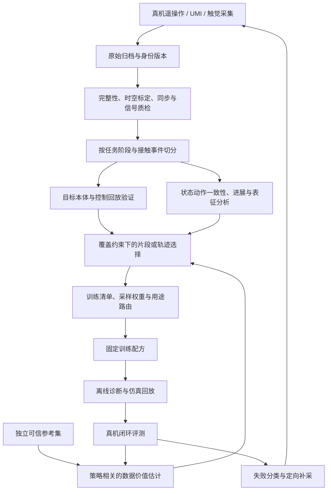

# 机器人数据质量与高阶筛选：真机、UMI、触觉数据的近两年研究与技术路线

**整理日期：2026-09-21**  
**主要时间范围：2024-09-21—2026-09-21。** 按首次公开日期纳入；2024 年早期的 UMI、Re-Mix 作为窗口外基础工作单独标注。  
**面向问题：** 已完成基础数据检测后，如何进一步判断数据是否可执行、可学习、能提高目标任务成功率，以及下一批数据应该采什么。  
**阅读建议：** 快速决策先读第 1、7、9 节；选方法读第 3—6 节；设计实验读第 8 节。文献编号对应第 11 节的原始来源。

## 1. 主要结论与推荐顺序

你下一步最值得做的是，把已有的“坏数据检测”升级成一个**面向训练用途的数据决策系统**：保留物理与信号硬门槛，在合格数据内评估片段价值、覆盖度和目标策略收益，最后用真实闭环实验校准筛选规则。

近两年的相关工作可以归为五条主线：

1. **从整条轨迹筛选走向片段筛选。** S2I、SCIZOR 处理同一条示范内的质量差异；成功轨迹也可能含有大量停顿和无效动作，失败轨迹也可能保留有用步骤。[S2I][R03]、[SCIZOR][R06]
2. **从人工代理指标走向策略相关的数据估值。** DemInf 用状态—动作互信息衡量示范；DataMIL、QoQ、RoboDrop 用目标数据上的学习信号；CUPID、ATHENA 进一步依赖策略执行反馈。这里必须区分“改善验证损失”和“改善闭环回报”。[R04]—[R12]
3. **从单样本排名走向数据集合的组成。** Re-Mix 优化数据域混合比例；SIEVE 保留操作原语及其衔接结构。单条数据都不错，不代表放在一起能形成好的训练集。[Re-Mix][R01]、[SIEVE][R11]
4. **UMI 的核心质量增加了“对目标机器人是否可执行”。** FeasibleCap 在采集时反馈约束；VISTA 离线做本体相关评分；HiFi-UMI 强化位姿、同步和回放验证。轨迹质量应写成与机器人、控制器有关的条件量。[R17]—[R19]
5. **触觉的重点从单帧外观走向接触动态与物理信息。** Sparsh、AnyTouch 提供表征底座；exUMI、AnyTouch 2 重视动作条件下的时间变化；接触 Fisher 信息工作直接讨论哪些接触数据更有辨识价值。它们不能全部称为“数据筛选算法”。[R21]—[R28]

**建议实施顺序（本报告的工程判断，不是论文统一结论）：**

| 优先级 | 下一步工作 | 参考方法 | 预期解决的问题 |
|---|---|---|---|
| P0 | 建立与训练集隔离的人工核验参考集；保存 episode、片段、采集批次的身份和版本 | 可靠评估与复现的基础；具体选择器可使用示范或执行反馈作参考 | 筛选收益无法验证、同源泄漏、结果不可追溯 |
| P1 | 在现有质检后增加任务阶段、接触事件、联合状态—动作去重和覆盖配额 | SCIZOR、S2I、Data Scaling Laws | 合格但冗余的数据，以及局部坏片段 |
| P1-UMI | 做目标机器人 IK、关节速度、自碰撞、控制回放误差检查 | UMI、VISTA、FeasibleCap | 人能示范、机器人无法复现 |
| P1-触觉 | 校准版本、零点/背景漂移、饱和、同步与接触事件分层 | exUMI、AnyTouch 2、NeoData | 传感器伪影与真实接触变化混淆 |
| P2 | 无干净参考集先做 DemInf 基线；已有参考集试 QoQ / RoboDrop 类局部梯度打分 | DemInf、QoQ、RoboDrop | 外观正常但动作监督不合适 |
| P3 | 用执行失败反向更新选择和补采；需要从大池共训时试 DataMIL，多任务规模化再考虑 ATHENA | CUPID、DataMIL、ATHENA、HIL-UMI | 筛选与最终任务成功脱节 |

对于你当前项目，第一轮不建议同时实现全部复杂方法。比较有解释力的最小组合是：**当前规则基线 + 片段/覆盖筛选 + 一种学习信号筛选 + 固定真机评测**。UMI 和触觉分别增加专用检查，但共享数据版本、片段索引和评测协议。

## 2. 检索范围、证据边界与质量定义

### 2.1 这份报告如何形成

本报告是带原始来源核验的技术综述，不是声称穷尽检索的 PRISMA 系统综述。检索包括 arXiv、RSS/ICLR/ICRA/CoRL 官方论文或项目页、作者代码仓库。搜索引擎的转载和自动摘要只用来发现线索，技术判断引用作者原文或官方项目资料。

主要检索词包括：`robot data curation / demonstration quality / data selection / influence functions / mutual information`；`Universal Manipulation Interface / UMI physical validation / feasibility / synchronization`；`tactile data curation / contact information / cross-sensor representation / force dynamics`。另对 2026 年的最新方法、UMI、触觉分别补检。用标题与 arXiv ID 去重，不把不同版本当成多篇论文。

纳入标准：直接研究机器人数据选择，或对质量管理有明确参考价值的采集系统、表征与数据集。排除仅讨论通用文本/图像清洗、与机器人 UMI 无关的生物信息学 UMI，以及没有可核验技术来源的宣传性结论。

阅读深度也有区别：DemInf、DataMIL、CUPID、SCIZOR、QoQ、RoboDrop、ATHENA、SIEVE、VISTA、接触 Fisher 信息和 NeoData 查阅了正文中的相关方法或局限；其他条目主要核对摘要、论文元数据和官方项目说明。**未复现算法、未跑作者代码、未下载检查大型数据集。** 论文所称“开源”不自动等于已核验完整数据、许可证和运行可用性。

证据在报告中分为：**论文报告**、**综合判断**、**工程建议/待验证假设**。标记“预印本”表示本次未核实正式发表，不代表质量差；已核实会议状态的条目另列。不同研究的成功率来自不同任务、机器人和预算，不能直接横向排名。

### 2.2 不要把“质量”压成一个数字

建议区分以下六个问题。这里的分类是对文献的综合，不是某篇论文的原始体系。

| 维度 | 核心问题 | 可观察量 | 低分后的合理操作 |
|---|---|---|---|
| 信号完整性 | 是否真实、完整地记录了交互？ | 丢帧、时间戳、标定、漂移、饱和、解码 | 修复、隔离、重采 |
| 物理可执行性 | 目标机器人能否执行？ | IK、关节限位/速率、碰撞、回放跟踪误差 | 重定向、重定时或对特定本体禁用 |
| 示范行为质量 | 行为是否有效、稳定地完成目标？ | 成功、进展、绕路、停顿、失败恢复 | 片段选择、用途分流 |
| 可学习性 | 现有观测能否解释动作？ | 条件动作分歧、状态—动作互信息、动作语义一致性 | 修正时间对齐/表示，补历史或模态 |
| 覆盖与冗余 | 是否提供集合里缺少的经验？ | 场景、物体、技能、接触状态、原语转移覆盖 | 配额、去重、集合选择 |
| 目标策略价值 | 加入后是否帮助目标策略？ | 验证梯度、数据影响、执行回报、重训增益 | 软权重、目标任务子集、主动补采 |

三个易混淆的例子：

- 一条清晰、同步、成功的 UMI 轨迹，仍可能超出目标机器人的工作空间。
- 一条慢速压合或等待材料稳定的轨迹，可能是接触任务的正确策略，不能只因“停顿多”被删除。
- 一条在已有场景重复很多次的高质量示范，其新增价值可能小于一条合格但覆盖新接触条件的示范。

因此，工程上更合适的输出是**质量向量 + 异常时间区间 + 可用用途 + 目标本体/任务权重**，而非单个全局合格率。

## 3. 真机数据：从质量代理到任务收益

### 3.1 代表性方法比较

“需要 rollout”指筛选本身是否依赖策略执行反馈；方法最终仍应通过闭环执行验证。

| 方法及首次公开时间 | 筛选层级、信号 | 额外输入/成本 | 可参考的用法 | 关键边界 |
|---|---|---|---|---|
| **Re-Mix，2024-08，窗口外基础** [R01] | 数据域；相对参考策略的超额损失，DRO 学混合权重 | 预定义数据域、代理训练 | 决定不同任务/来源的采样比例 | 不是逐条质检；动作尺度与参考策略过拟合会影响权重 |
| **S2I，2024-09；ICRA 2025** [R03] | 语义片段；对比学习选择及轨迹优化 | 少量专家参考示范；文中使用 3 条 | 对混合质量示范做片段级利用 | 轨迹优化需要重新检查观测—动作一致性 |
| **DemInf，2025-02；RSS 2025** [R04] | 状态—动作 chunk 估值，聚合到轨迹；VAE + kNN 互信息 | 不需质量人工标注或执行反馈 | 无参考集条件下建立学习相关基线 | 原文假设输入示范成功；不能把失败轨迹直接当成同一问题 |
| **DataMIL，2025-05；ICLR 2026** [R05] | 用 datamodels 估计候选数据对目标学习指标的贡献 | 小目标数据集；额外训练/元梯度计算 | 从 OXE 类大池选择共训数据 | 离线代理仍不是实际回报；依赖目标集代表性 |
| **SCIZOR，2025-05** [R06] | 状态—动作级；任务进展预测 + 联合表征去重 | 自监督进展模型、特征提取/聚类 | 大量长停顿、重复、局部次优示范 | “时间流逝≈进展”的代理会遇到等待与恢复动作 |
| **CUPID，2025-06；CoRL 2025** [R07] | 轨迹对策略期望回报的影响 | 已训练策略、带回报的执行轨迹、梯度/曲率近似 | 根据真实失败筛选训练或新增示范 | 需要 rollout；估计方差、计算成本和样本相互作用仍存在 |
| **QoQ，2026-03，预印本** [R09] | 对验证样本的最大影响，随后轨迹聚合 | 可信验证示范、训练策略和梯度 | 面向特定任务的数据价值排序 | 验证集不覆盖的有效策略可能被低估 |
| **ATHENA，2026-06，预印本** [R10] | 多任务影响；梯度压缩、低秩曲率近似、任务内外作用 | 多任务策略与执行反馈；较高工程成本 | 将影响估计扩展到大 VLA | 加速的是归因计算，仍需执行反馈，且不等于整体训练同倍加速 |
| **SIEVE，2026-07，预印本** [R11] | 原语与衔接结构；预算分配后选择代表性轨迹 | 分段、表征、聚类 | 保留长任务的技能组合与过渡覆盖 | 依赖原语发现质量；不能据此保证真实接触任务收益 |
| **RoboDrop，2026-09，预印本** [R12] | 一轮 warm-up 内局部梯度相容性，聚合到 episode | 干净验证集；任务语义/视觉近邻及梯度 | 审计错配、漂移、执行错误等混合污染 | 极新工作；局部相似与梯度信号仍需目标平台验证 |

### 3.2 DemInf：适合低成本起步，但要守住假设

DemInf 的直观出发点是同时保留动作变化与状态条件下的可预测性：

\[
I(S;A)=H(A)-H(A\mid S).
\]

论文在状态与动作的 VAE 潜空间中使用近邻互信息估计，再跨时间聚合。相比仅用轨迹平滑度，它显式考虑“这个状态下的动作是否有规律”。但原文也指出：长时间停住可能很可预测；其设定假定示范最终成功；逐条贪心删除会改变分布。[方法与局限][R04]

**工程建议：** 先按任务和可用观测分组，在成功子集内使用；对历史依赖任务保留观测历史，对触觉任务纳入接触信息。相似 RGB 下动作不同，可能来自不可见接触或操作者合法的不同策略，不能自动解释为脏标签。

### 3.3 SCIZOR 与 S2I：粒度比更复杂的模型更值得先改

SCIZOR 用两帧间时间间隔构造自监督进展信号，并在联合状态—动作空间去重。其实现有一条直接值得借鉴的约束：**先构造含观测历史与动作序列的样本，再移除低质量样本**，避免把原本不相邻的时刻拼成虚假连续序列。[正文与附录 A.6][R06]

S2I 则通过少量专家参考做片段选择，并优化次优轨迹，给出了“不是所有低质量示范都只能整体丢弃”的可行路线。[R03]

**工程建议：** 第一版先做片段标注和训练 loss mask，避免重写动作。对 ACT、Diffusion Policy、Flow Matching，明确区分“删除一个训练窗口”和“删除窗口内某些目标”；后者可能还需要阻断无效动作作为模型输入，以免被 mask 的错误值仍污染其他预测。

### 3.4 DataMIL、QoQ、RoboDrop 与 CUPID：相似外观不等于训练价值

DataMIL 将训练数据选择视为模型行为随训练集变化的问题，并用目标任务 BC 类损失作为可计算代理。它可以从视觉上不接近目标任务的来源中找到有用数据；不能把它描述成筛选时直接观察了真实成功率。[R05]

QoQ 强调验证集内部的局部相关性：对一个训练状态—动作对，不简单平均所有验证样本影响，而关注最相关的最大影响，并通过轨迹聚合减少片段级偏差。[R09]

RoboDrop 更显式地构造局部参考：先按任务语义和视觉相似度检索，再比较训练过程中的梯度方向。它把漂移、时间错位、非专家错误统一看成监督是否与可信目标冲突的问题。[R12]

CUPID 的区别在于用执行轨迹的回报估计示范对闭环表现的影响。这更贴近部署目标，但增加机器人执行与估计成本。其原文明确指出，贪心选择没有充分建模示范之间的联合效应。[R07]

**选型规则：** 没有干净目标集时先建立参考集；有目标集但缺机器人时间时优先离线方法；有稳定闭环评测与执行日志时，才有条件把归因目标推进到回报。不能因某方法用了“influence”这个词，就假定它已证明样本的精确因果作用。

### 3.5 集合组成与失败数据：避免“越纯越好”

Data Scaling Laws 在其操作任务上发现，环境、物体覆盖比反复增加相同条件下的示范更有价值；Is Diversity All You Need? 又指出，任务多样性和操作者速度偏好的多样性并不等价，后者可能带来学习歧义。[R02]、[R08]

两者并不冲突：**应增加部署需要的条件覆盖，同时减少没有观测依据的监督冲突。** 这也是为什么去重应联合考虑状态、动作、任务和阶段，而不是只按图像相似度删除。

失败数据应按用途分流：有效前缀和可靠恢复可作为局部模仿监督；导致失败的动作可用于价值/失败预测、偏好学习或诊断，而不应无条件加入成功行为克隆。2026 年的 How to Utilize Failure Demo Data? 用成功—失败潜在差异和注意力差异选择失败数据，但本次核验到的证据是仿真结果，不能升级为真机已证实。[R13]

## 4. UMI 数据：先保证记录正确，再保证机器人能复现

### 4.1 代表工作与适用范围

| 工作 | 主要贡献 | 对质量系统的启发 | 必须保留的边界 |
|---|---|---|---|
| **UMI，2024-02，窗口外基础** [R14] | 手持示范接口；延迟与动作表示设计；运动学筛选 | 采集与部署接口必须对齐 | 无本体采集不意味着对任意本体都可用 |
| **FastUMI，2024-09** [R15] | 简化采集、跟踪与验证生态 | 记录设备、跟踪、标定和处理版本 | 系统可扩展性不等于学习收益筛选 |
| **RDT2，2026-02** [R16] | 大规模 UMI 数据与跨本体训练 | 看数据规模、表示、训练配方的联动 | 不是独立质检方法；增益不能全归因数据量 |
| **FeasibleCap，2026-03** [R17] | 采集时检查可达性、关节速率、碰撞并反馈 | 将废数据预防前移到采集端 | 约束依赖目标模型，跨本体泛化仅限验证范围 |
| **VISTA，2026-06** [R18] | 鱼眼视觉对齐 + 本体相关物理验证 + 共训 | 连续质量评分与可执行性矩阵 | 视觉对齐和物理筛选是两个贡献，不能混为一个 |
| **HiFi-UMI，2026-07** [R19] | 位姿、双手相对位姿、硬件同步、视野及回放验证 | 将采集链误差作为端到端指标 | 高保真系统的效果不能外推到任意廉价 UMI |
| **HIL-UMI，2026-09** [R20] | 当前策略与人类动作差异触发采集，进展优势辅助后训练 | 从静态清洗走向策略引导补采 | 策略在人的观测流上被查询，不能覆盖所有机器人自主失败状态 |

### 4.2 推荐检查链（工程综合）

**记录完整性 → 时空标定 → 连续位姿恢复 → 本体适配 → 控制回放 → 任务效果。**

1. **完整性与同步。** 检查 RGB、左右手轨迹、夹爪、IMU/跟踪流是否齐全；区分硬件时间、主机时间、帧编号；记录延迟与抖动。记录端同步与部署端控制延迟是不同误差源。
2. **坐标与尺度。** 检查 camera-to-gripper、世界/基座坐标、左右手映射、长度单位、四元数顺序、夹爪宽度定义。不能把错误外参造成的稳定偏置只当随机噪声处理。
3. **跟踪可靠性。** 检查重定位跳变、失跟踪区间、回环后的轨迹变化、双手相对位姿异常；微分前先处理时间间隔与旋转表示。全局平均误差要与接触局部误差分开。
4. **目标本体可行性。** 连续求解 IK，检查关节位置和速率、解分支跳变、自碰撞、工作空间与奇异区；单帧 IK 成功不代表整段可执行。
5. **控制回放。** 在目标控制频率、限速和延迟下回放，记录末端位置/姿态偏差、夹爪时序与接触事件偏差。几何仿真不能替代真实摩擦、柔顺和力学验证。
6. **任务与数据价值。** 通过前五层后，再做片段质量、覆盖度和策略相关筛选。可执行但无效的示范仍不应无条件作为正例。

### 4.3 VISTA 最值得借鉴的设计，以及不宜照搬的部分

VISTA 在完整性预检后，分别衡量轨迹连续性、自碰撞风险和执行保真度；后两者依赖目标本体。论文采用加权乘积形成总体评分，使某一物理维度的严重失效不会被其他高分轻易抵消。**其自碰撞检查明确不包含场景物体，因此不能把高分解读成已验证环境碰撞或接触力安全。**[§3.3][R18]

**工程建议：** 为每条轨迹保存 `trajectory × embodiment × controller_version` 的可行性记录。泛化预训练保留本体兼容矩阵；指定机器人微调时使用对应列。原始轨迹不因某个本体不适用而永久删除。

不要直接把统一 jerk 阈值或最低单帧分数作为全部任务的删除规则。高速释放、接触冲击、柔顺压合与自由空间搬运应有不同解释。对异常点先区分“跟踪跳变”“真实动态事件”“目标控制器跟不上”，再决定修复或禁用。

### 4.4 从事后筛选走向采集闭环

FeasibleCap 的可借鉴点是即刻给采集者物理约束反馈，减少“采完才发现无法执行”的浪费。[R17] HIL-UMI 则把反馈推进到学习层：当前策略在手持观测上推理，通过人类动作与策略预测的差异确定补采区域，并借助进展优势信息改善训练。[R20]

**建议并行记录两类采集反馈：** 一类说明“这段数据无法用”；另一类说明“这段数据很值得采”。前者是质量门槛，后者是知识缺口。两者应使用不同标记，避免把高不确定但有价值的困难样本直接踢掉。

## 5. 触觉数据：按接触事件与物理信息组织，而非只看图像

### 5.1 相关研究中，哪些是直接筛选，哪些是可借用组件

| 工作 | 类型、时间/状态 | 已有方法或证据 | 可以借鉴什么 |
|---|---|---|---|
| **Sparsh / TacBench** [R21] | 表征与评测；2024-10，CoRL 2024 | 多种光学触觉传感器上的自监督表征，配套力、滑移等任务评测 | 用触觉特征而非普通 RGB 特征做检索、分布分析；它本身不是筛选器 |
| **AnyTouch / TacQuad** [R22] | 跨传感器静动态表征；2025-02，ICLR 2025 | 对齐多模态、多传感器数据，结合静态和动态学习 | 避免聚类只反映传感器外观；跨传感器分层评测 |
| **exUMI / TPP** [R23] | 采集与动作条件触觉预训练；2025-09，CoRL 2025 | 位姿/夹爪可靠采集、自动标定、触觉时序预测 | 打通动作—接触—未来触觉的可预测性分析 |
| **Quality Over Quantity: Curating Contact-Based Robot Datasets Improves Learning** [R24] | 直接接触数据估值；2025-10，预印本 | 用接触感知 Fisher 信息为物体动力学、形状学习选择数据 | 最优实验设计、接触信息增益；不是已验证的通用触觉图像/VLA 筛选器 |
| **AnyTouch 2 / ToucHD** [R25] | 动态表征与分层数据；2026-02，ICLR 2026 | 原子触觉动作、真实操作和触觉—力配对，强调动态感知层次 | 数据标签和评测必须覆盖力变化与时间结构 |
| **OmniUMI** [R26] | 多模态接口与策略；2026-04，预印本 | 同步记录 RGB、深度、位姿、触觉、内部抓握力与外部交互力矩 | 将内部握力与外部受力分开建模；检查采集—部署一致性 |
| **WT-UMI** [R27] | 全身触觉、力监督控制；2026-06，预印本 | 人类与机器人数据互补，以力条件修正目标位姿 | 人的接触力不能直接等同机器人可执行目标 |
| **N₀-Foundation / NeoData / NeoForce** [R28] | 大规模真机与 UMI 触觉系统；2026-08，预印本 | 给出完整性、动作、episode、视频与迁移可行性分层处理；强调力相关表征 | 对多模态流水线和物理表征组织有直接参考价值；大规模数据声明尚未由本报告独立审计 |

本次检索中的**直接“筛选触觉操作示范→提升目标策略”证据，少于通用机器人示范筛选的证据**。更常见的是传感器表征、同步采集、动力学辨识和下游策略融合。因此，把 DemInf / influence / coreset 扩展到触觉是合理研究方向，但不能说已经有一种公认最优方案。

### 5.2 先区分三种触觉数据对象

以下是工程分类，避免混用质检规则：

- **光学触觉图像/视频**：检查背景照明、弹性体状态、标记点/纹理、接触区域、视野遮挡、曝光及帧同步；Sparsh/AnyTouch 主要对这一类有直接表征参考。
- **力/压力/剪切阵列或六维力矩**：检查零偏、温漂、通道失效、量程、饱和、迟滞、采样频率、接触坐标与力矩参考点。不能直接用光学触觉 encoder 处理这类数值流。
- **与动作同步的接触轨迹**：检查何时接触、何时滑移、何时释放，动作改变后接触状态如何响应。这一层才直接连接接触技能学习。

对于非视觉传感器，UniTac-NV 提供使用 F/T 真值对齐不同非视觉触觉传感器的相关数据工作，可作为补充入口。[官方数据仓库][R32]

### 5.3 触觉数据质量的五层检查（工程建议）

| 层次 | 建议指标 | 应如何使用 | 常见误判 |
|---|---|---|---|
| 传感器健康 | 无接触基线、漂移率、饱和比例、坏通道、凝胶/表面维护版本 | 按设备、日期、温度/维护状态统计；异常先隔离 | 将真实持续受力“校正”为零点漂移 |
| 多模态同步 | 时间戳差、事件延迟、漂移随时间变化、冲击/夹紧事件一致性 | 优先硬件时钟；互相关只作辅助估计 | 用周期性信号得到错误对齐；全程用一个常数延迟 |
| 接触语义 | 无接触、初次接触、稳定抓持、滚动、滑移、释放及恢复 | 分事件打分、抽样和保留上下文 | 把无接触全删掉，失去接近/释放的决策边界 |
| 物理一致性 | 触觉—F/T—夹爪—物体运动的关系 | 用独立真值或跨模态约束定位故障 | 大接触面积不总等于大合力；材料/几何会改变映射 |
| 学习与任务收益 | 接触状态覆盖、跨传感器泛化、接触阶段损失、目标策略成功率 | 决定权重和补采方向 | 材料分类提升被当作插装成功率提升 |

建议把“接触有效占比”改成**各事件的覆盖曲线**。例如 90% 接触帧并不一定优于 40%：前者可能是一段长时间静压，后者可能包含丰富的接触建立、滑移、恢复与释放。保持一部分无接触负例及事件前后窗口，并保留原始时间轴。

### 5.4 触觉的高阶筛选：三条可实验的路线

**路线 A：物理信息增益。** 接触 Fisher 信息工作证明了在其动力学/形状辨识设定下，数据可以按参数辨识价值选择。[R24] 若已有摩擦、刚度或接触模型，可尝试比较一段新接触是否增加信息矩阵的有效方向。工程上可采用带正则的 log-det 增量等最优设计目标；这是扩展建议，不等同原文唯一实现。没有可靠模型时，不应计算一个形式化分数就宣称物理信息量已测准。

**路线 B：动作条件下的触觉预测与跨模态一致性。** exUMI 的 TPP 和 AnyTouch 2 给出动态表征依据。[R23]、[R25] 可训练预测模型，比较相似状态与动作下的触觉后果，再将异常交叉检查。**预测误差高既可能是损坏，也可能是罕见有价值的滑移；误差低也可能只是重复静止。** 建议同时考虑健康度、覆盖度、模型分歧和可复核事件。

**路线 C：触觉带来的增量决策信息。** 在固定数据划分和同等训练预算下，比较视觉/本体状态模型与加入触觉的模型，定位只有触觉才能区分动作的阶段。可用条件互信息的概念描述目标：

\[
I(A_{t:t+H};T_{t-L:t}\mid V_{t-L:t},P_{t-L:t},\text{task}).
\]

这里 (T,V,P) 分别代表触觉、视觉、本体状态。这是**研究目标表达**，不是现成无偏估计器。简单做单帧置零或打乱触觉容易制造分布外输入，不能直接当因果证据；需要重训消融、受控遮挡/接触实验及跨设备测试共同验证。

### 5.5 对最新大规模触觉工作应怎么读

NeoData 的处理流程将修复、异常区间、近静止片段和迁移可行性纳入统一管线，值得参考；但“含更多触觉小时”并不直接回答哪一小时最有价值。其文中按任务时长分布去除异常快慢样本的规则，也不能无条件套到你保留恢复行为或困难物体的目标上。[R28]

选择触觉预训练资料时应额外核查：是否包含你需要的切向力/滑移动态；传感器是否匹配；帧间时间是否真实；接触标定标签来自真值还是推断；数据划分是否把同一物体、同一维护周期的数据同时放入训练和测试。这些因素比总帧数更接近可迁移性。

## 6. 更高阶的数据筛选：从“分数排序”到“决策”

### 6.1 局部梯度相容性与影响函数

以下公式用于解释方法家族，**不声称复现每篇论文的全部实现**。设训练样本梯度为 (g_i=\nabla_\theta\ell_i)，可信验证目标的梯度为 (g_v)。做一步小更新后：

\[
L_v(\theta-\eta g_i)\approx L_v(\theta)-\eta g_v^Tg_i.
\]

因此正内积在局部一阶近似下表示更新方向相容；余弦相似度去掉了梯度尺度，表达的是方向而非收益幅度。RoboDrop 采用与任务/视觉上下文匹配的局部参考，以减少不相关阶段之间的干扰。[R12]

经典加权样本影响的近似形式为：

\[
\frac{dL_v}{d\epsilon_i}\approx-g_v^T(H+\lambda I)^{-1}g_i.
\]

它依赖局部优化近似、曲率估计与参考目标；真实深度网络不完全满足理想条件。QoQ、CUPID、ATHENA 属于不同的机器人适配路线，不能用上述一个公式抹掉它们在验证数据、执行回报和计算近似上的差别。[R07]、[R09]、[R10]

**实践取舍：** 先对 action head 或有限模块提取压缩梯度，再检查排序稳定性；如改用小代理策略，应验证其筛选对最终 ACT/DP/VLA 的迁移。小模型排序、训练 checkpoint 和随机种子都应进入筛选版本记录。

### 6.2 集合级选择：保留互补性而非只取 Top-K

SIEVE 的“原语 + 转移接口 + 组合模式预算”提供了比整条轨迹相似度更细的结构视角。[R11] 针对你现有数据，建议先用容易解释的分层配额或聚类代表样本做基线，再考虑子模覆盖、DPP、最优传输等集合优化。

一个可实现的设计目标是：

\[
\max_{S\subseteq D}\left[\sum_{i\in S}u_i+\lambda C(S)-\mu R(S)\right],
\quad \sum_{i\in S}c_i\le B,
\]

其中 (u_i) 是经过校准的任务价值，(C(S)) 是条件/技能/接触覆盖，(R(S)) 是冗余，(c_i) 是训练或采集成本。这是本报告的工程抽象；具体的近似保证取决于所选函数，不能自动继承子模优化的性质。

必要约束包括：任务最低配额、困难阶段最低配额、不同采集日期/设备覆盖、稀有恢复保留，以及本体可行性。否则全局 Top-K 容易留下大量相似的简单抓取、删掉复杂接触与转移。

### 6.3 软加权、课程学习与用途路由

建议把数据决策从 `keep/drop` 扩展为：

| 决策 | 适用情况 |
|---|---|
| 保留并正常训练 | 记录可信、动作有效、目标任务相关 |
| 保留但降权/限制重复采样 | 合法但冗余、质量存在不确定性 |
| 片段训练或 mask | 局部损坏/次优，其他片段仍可用 |
| 修复后重新验证 | 可确定的时钟/映射/格式问题 |
| 分流到表征、价值或失败模型 | 行为克隆动作不可靠，但观测或结果有价值 |
| 隔离并补采 | 标定失效、不可恢复错位、目标条件缺失 |

课程学习可先用可靠样本稳定训练，再加入困难/恢复样本；重加权可根据验证信号更新。两者均需保留固定对照，防止“先学容易样本”变成长期忽视尾部任务。

### 6.4 面向模型弱点的主动补采

把每次执行的失败类型和发生阶段，映射回数据覆盖矩阵：抓取偏移可能需要不同初始姿态；夹持后掉落可能缺少滑移前兆；插装卡住可能缺接触对齐或恢复；UMI 回放失败可能是物理限制而非数据数量不足。

HIL-UMI 是近期把策略差异用于补采的直接例子。[R20] 对你项目更容易起步的方案是：对闭环失败做少量人工分类，优先补齐出现频繁、覆盖不足且可通过数据改善的失败条件。仅按模型不确定性采样可能不断追逐坏传感器或不可实现目标。

### 6.5 世界模型、仿真回放与 VLM 评审

可将世界模型用于预测行为后果、构造疑似异常队列，把 VLM 用于任务描述、阶段和可见结果的辅助标签。RoboCurate 提供了针对**合成机器人数据**的具体例子：把预测动作放入仿真回放，与生成视频运动进行一致性比较。[R30]

工程上应把验证器的能力边界明确写入结果：VLM 的“看起来成功”不能证明未观测的接触力、动作时间对齐或关节可执行性；世界模型对罕见接触的错误也不能作为删除真实数据的充分理由。采用多源一致性、人工抽检与真实回放校准，逐级花费预算。

### 6.6 真正更前沿的研究问题

以下是待验证方向，不是本报告宣称已经成立的新方法或创新性结论：

1. **本体与策略双条件的数据价值：** 同一条示范对不同机器人、控制器和策略家族的价值怎样变化？
2. **接触事件级的联合选择：** 能否在不牺牲接近与恢复上下文的前提下，按接触信息增益和策略收益选训练窗口？
3. **异质数据用途分配：** 给定真机、UMI、触觉和失败轨迹，自动决定它们用于 BC、表征学习、价值估计还是诊断。
4. **数据选择的稳定性：** 一种筛选是否只帮助它用于打分的代理模型，能否跨 checkpoint、策略和采集批次维持收益？
5. **选择与采集联合优化：** 同样预算下，重训一个归因模型与多采十条关键恢复示范，哪一个收益更高？

## 7. 推荐的整体技术路线

### 7.1 数据流与反馈流

这是推荐架构，不表示所有项目都必须上仿真、世界模型或影响函数。可先实现轻量分支，随着数据与评测成熟逐步增加。

### 7.2 数据组织：一个原始池，多个训练用途视图

建议每条轨迹至少记录四组信息：

| 信息组 | 建议字段 |
|---|---|
| 身份与来源 | episode/source-session/operator/device/task/scene/object ID，采集日期，原始文件哈希 |
| 表示与标定 | action/state 的语义、绝对/相对、坐标系、单位、时钟、控制频率、标定/传感器维护版本 |
| 分层质量 | 检查名、原始指标值、阈值版本、异常时间区间、置信度、人工复核结果、修复历史 |
| 训练决策 | 数据划分、有效窗口、loss mask、采样权重、可用用途、目标本体、评分策略 checkpoint |

原始池只追加，筛选通过可复现清单实现。避免重新拷贝一份“clean_data”后丢失被删除理由。对同一原始数据可以并存“机器人 A 微调”“机器人 B 预训练”“触觉表征”“失败价值模型”四种视图。

### 7.3 把阈值从经验常数变成可校准规则

1. 从各任务、设备、操作者、成功/失败类别分层抽取小样本，人工标注错误类型和时间区间。
2. 保留传感器硬限制；对经验阈值按任务阶段和设备校准。分位数可产生检查队列，不能直接定义真值。
3. 输出“明确无效 / 需要复核 / 可用 / 稀有高价值”而非二分结果；对分布外设备或任务允许弃权。
4. 检查筛选前后覆盖、事件比例与失败恢复样本的流失。
5. 通过重训和执行测试确认阈值价值，再固定版本用于下一批数据。

**特别针对已有基础工作：** 你项目中的图像质量笔记已经把像素保真与动作效果分开。下一轮应保留这些检测作为输入特征，把问题改为“这一类图像变化是否影响接触阶段、关键窗口和最终策略”，不要继续仅优化 PSNR/SSIM 分数。该判断基于已阅读的本地笔记，本报告没有重新核验其中的历史实验数值。

## 8. 怎样证明筛选真的有效

### 8.1 至少同时测三个层面

| 层面 | 主要指标 | 回答什么问题 |
|---|---|---|
| 质检本身 | 各错误类型的 precision/recall、误删率、人工复核一致性 | 是否找到了真实错误？ |
| 数据集合 | 保留帧/窗口/episode 数，任务和接触事件覆盖、近重复、设备与批次分布 | 删掉的是冗余还是困难样本？ |
| 下游学习 | 真机任务成功率、分阶段成功、恢复率、完成时间；接触任务另测力/滑移等 | 是否真正改善部署？ |

离线 action loss、阈值准确率、预测 jerk、触觉力误差可以作为诊断指标，但不能自行代替闭环结果。REAL-I Challenge 2026 的总结也专门讨论了离线动作指标预测执行成功的局限。[R31] AgiBot World 的标准化采集与人工闭环验证则可作为组织流程的参考，而非某个自动评分器的证据。[R29]

### 8.2 先做一轮有解释力的筛选实验

以下规模是**示例设计，需按你的实际数据量调整**；不代表已经执行，也不承诺统计功效。

选择三类已有任务：普通抓放、精密插装/接触对齐、柔性或易滑物体操作。没有触觉时先做前两类，触觉路线可以独立验证。

| 实验组 | 内容 | 主要用途 |
|---|---|---|
| B0 | 当前基础质检后的全量数据 | 真实起点 |
| B1 | 从 B0 中按任务分层随机保留，与候选法同样预算 | 区分“少数据”与“选得好” |
| M1 | 片段检查 + 联合去重 + 覆盖配额 | 验证低成本升级 |
| M2 | M1 加一个数据估值模块：DemInf 或 QoQ/RoboDrop 类 | 验证学习信号是否有增量价值 |
| M3（后续） | 用执行反馈的 CUPID 或目标共训的 DataMIL | 验证更高成本路线是否值得 |

第一轮先比较 B0、B1、M1、M2；若真实执行预算不足，先做离线诊断与可行性测试，再预先确定进入真机的组别，不依据最终测试结果来筛选候选。

对保留比例可以预设 100%、75%、50% 的小范围扫描。**比例是实验参数，不是最佳实践。** 不要把别的论文“保留三分之一有效”的结果当成你数据的默认阈值。

### 8.3 公平比较必须锁定的变量

- **数据划分先于所有拟合。** 按原始 episode、采集 session、物体/场景或日期分组；相邻帧、裁剪版、重编码版、修复版不能跨训练与最终测试。近重复检索也要跨原始来源追踪。
- **区分三个集合。** 候选训练池；用于选择和调参的可信参考/验证集；最终锁定测试。用于 CUPID 等打分的执行反馈属于开发数据，需要另留最终闭环评测条件。
- **分别比较数据效率与计算效率。** 同样训练步数下测试筛选价值；再把特征提取、筛选训练、梯度计算、额外 rollout 全部计入总成本，比较是否真正省资源。
- **统一数据预算单位。** 轨迹数、帧数和 action chunks 并不等价。短轨迹筛选会改变有效训练 token/时间覆盖，应同时报告保留轨迹与有效窗口。
- **固定策略与部署配方。** 控制 action 表示、归一化、chunk 长度、执行步数、频率、图像处理、checkpoint 选择和随机种子。必要时单独测代理策略筛选向最终模型的迁移。
- **配对执行条件并随机化测试顺序。** 使用可复现的初始布局/物体条件，跨方法平衡日期与设备状态，记录真实独立试验单位。

试验次数少时应报告成功数/总数及置信区间。训练随机种子和执行初始条件是两个不确定性来源；不能把同一策略的大量相邻动作帧当独立样本。可用二项区间描述给定策略的成功率，再按训练种子和场景进行分层分析。小规模 pilot 用于排除明显无效方案，不能凭几个成功回合声称提升了几个百分点。

### 8.4 UMI 与触觉各自必做的消融

| 路线 | 最小消融 | 目的 |
|---|---|---|
| UMI | 基础质检 vs 加 IK/限位 vs 加控制回放 | 区分记录质量、几何可行性和控制可执行性 |
| UMI | 本体 A 得分用于 A，与用于 B 的表现比较 | 检查评分是否真的需要本体条件化 |
| UMI | 同一数据只改变已知时间偏移，其他条件固定 | 检查同步指标与策略影响关系；仅在离线副本上造污染 |
| 触觉 | 相同事件预算的均匀采样 vs 接触事件分层采样 | 检查是否只是保留了更多接触帧 |
| 触觉 | 同等预算下，视觉/本体状态 vs 加触觉重训 | 验证触觉的增量贡献 |
| 触觉 | 留出设备、采集日或传感器维护周期 | 检查表征和筛选是否利用设备外观捷径 |
| 通用 | 去掉覆盖约束、去掉片段粒度、去掉学习分数 | 找到收益来自哪一层 |

### 8.5 什么时候认为这个方向值得继续

建议事先约定两个门槛：

1. 在相同保留预算下，相比随机抽样与现有规则，候选法在目标闭环指标上有可信改进，或在性能相近时显著节省总成本。
2. 没有靠删除困难任务、损失恢复样本、泄漏测试数据或改变训练/部署参数取得表面收益。

若只提升了“识别人工注入错位”的 AUROC，而未提升自然数据上的策略，应把它定位为污染检测器。若只在一个代理策略上有效，应把它定位为该模型的训练优化组件，而不是通用数据质量标准。

## 9. 对现有工作的具体推进建议

### 阶段一：先把已有检测结果接到训练与评测

**交付物：** 每条数据的质量向量与区间；不可变训练清单；一份独立可信参考集；当前全量训练基线。

保留已有基础规则，但检查每条规则是否能回答三件事：检测的具体错误是什么；对应多少样本和哪些任务；被判异常的数据是否实际影响动作或接触结果。对于不能回答第三点的指标，暂作诊断而非强制删除。

### 阶段二：做片段与覆盖，形成第一个可用升级

**交付物：** 任务阶段/接触事件索引；联合状态—动作去重；分层采样；与随机保留的闭环对照。

先从容易解释的事件开始：夹爪闭合/打开、明显运动变化、接触起止、失败恢复。把模型建议交给少量抽检校准。引用 SCIZOR 的样本构造原则，确保动作块的时间关系不被筛选破坏。[R06]

### 阶段三：按数据类型补专项能力

**真机：** 增加 command 与实际 state 的区别和延迟检查，不能因为控制存在正常滞后就判“动作标签错”。

**UMI：** 建立目标机器人 URDF/控制器对应的可行性与回放指标，并记录失败原因。这里最优先读 VISTA 与 FeasibleCap。[R17]、[R18]

**触觉：** 建立基线/标定版本、接触事件统计与跨传感器留出评测。先证明异常检测可信，再建立动态表征。优先读 exUMI、AnyTouch 2 和接触 Fisher 信息工作。[R23]—[R25]

### 阶段四：上一个策略相关筛选器

没有可靠参考集时先做 DemInf 的受限基线；已有参考集时试局部梯度相容性或 QoQ。将每次筛选固定在指定模型和 checkpoint 上，记录在不同种子、不同 reference 子集下的排序变化。先做软权重或带覆盖约束的保留，避免一次性大规模删除。

如果目标是从异质大数据池给少量新任务共训，优先研究 DataMIL；如果已有执行反馈并希望解释部署失败，再试 CUPID。ATHENA 更适合确认需要大 VLA、多任务归因之后的计算扩展。

### 阶段五：把“数据清洗项目”变成持续的训练反馈

每轮训练与执行后输出：新增失败模式、被低估的任务阶段、模型分歧最大的可信窗口、补采条件清单。比较“继续优化筛选”与“补采关键条件”的收益。HIL-UMI 可以作为这一阶段的前沿参考，但其手持查询不替代真机闭环检查。[R20]

## 10. 阅读优先级、可用资源与局限

### 10.1 如果只精读六篇

1. **DemInf**：建立机器人示范质量与状态—动作可学习性的联系；同时阅读限制条件。[R04]
2. **SCIZOR**：理解片段级质量、联合去重，以及为什么不应先删帧再重新拼动作块。[R06]
3. **DataMIL 或 CUPID**：前者适合离线目标共训，后者适合有执行反馈的部署优化。[R05]、[R07]
4. **VISTA**：把 UMI 质量变成与本体有关的可执行性评分。[R18]
5. **exUMI**：理解触觉采集、动作条件动态表征与策略之间的关系。[R23]
6. **AnyTouch 2**：建立触觉数据从静态属性到动态接触的层次。[R25]

若主要负责 2026 年大 VLA 后训练，再追加 QoQ、RoboDrop 和 ATHENA；若主要负责触觉筛选算法，优先追加接触 Fisher 信息工作；若主要负责长期、多技能数据组成，追加 SIEVE。

### 10.2 已核对入口的实现资源

以下仓库在本次访问中能看到项目或实现说明，**未执行安装或实验，也未审计许可证兼容性**。

| 工作 | 入口 | 建议复用部分 |
|---|---|---|
| DataMIL | [UT-Austin-RobIn/datamil](https://github.com/UT-Austin-RobIn/datamil) | 数据估值与候选子集训练流程 |
| CUPID | [agiachris/cupid](https://github.com/agiachris/cupid) | 与执行反馈相关的数据归因 |
| SCIZOR | [UT-Austin-RPL/SCIZOR](https://github.com/UT-Austin-RPL/SCIZOR) | 进展预测、去重与数据加载衔接 |
| S2I | [Junxix/S2I](https://github.com/junxix/s2i) | 分段、参考示范与片段选择 |
| Sparsh | [facebookresearch/sparsh](https://github.com/facebookresearch/sparsh) | 光学触觉表征与 TacBench |
| AnyTouch | [GeWu-Lab/AnyTouch](https://github.com/GeWu-Lab/AnyTouch) | 跨传感器表征与 TacQuad 入口 |
| UniTac-NV | [JiannnH/UniTac-NV](https://github.com/JiannnH/UniTac-NV) | 非视觉触觉传感器的对齐数据说明 |

### 10.3 尚未解决的问题

- 公开基准可能偏向短任务和有限硬件；从小型混合质量数据到长期多模态生产数据的迁移仍需实验。
- 缺少覆盖所有真机、UMI、触觉的统一质量真值；人类认为优雅、专家示范成功、对某个策略有帮助是不同概念。
- 验证集会塑造数据价值。它若忽略困难状态、不同策略或不同传感器，选择器也会忽略这些条件。
- 触觉基础模型的良好表征结果不足以证明某种数据筛选直接提高操作成功；这一连接仍是明确的研究空间。
- 影响函数、世界模型与人工规则都有误差。应该允许低置信度、延后判断和人工复核，而不是强求所有样本自动二分类。
- 2026 年 7—9 月的新预印本和大规模数据发布需要时间积累独立验证；本报告不把作者报告的增益当作跨平台保证。

**与项目已有材料的关系：** 本报告阅读了现有图像质量笔记、VISTA 笔记、无本体迁移综述和失败数据笔记的相关片段，并重新核对本报告所引用的外部核心来源。未重新审计原始数据、检测脚本或历史训练结果，因此这里给出的是下一阶段方案，不是对现有质检覆盖程度的最终评定。

## 11. 文献与项目索引

下列采用作者—年份—完整标题—来源的技术报告格式。首发时间用于时间窗口判断；全文标记只表示读取过与本报告相关的正文，不表示逐页读完或完成复现。

### 通用/真机数据选择与组成

**R01.** Hejna, J., et al. (2024-08，窗口外基础). *Re-Mix: Optimizing Data Mixtures for Large Scale Imitation Learning.* arXiv:2408.14037。[论文][R01]。核验：官方摘要与元数据；用途：域级采样权重。

**R02.** Lin, F., et al. (2024-10；2026-06 更新). *Data Scaling Laws in Imitation Learning for Robotic Manipulation.* arXiv:2410.18647。[论文][R02]。核验：官方摘要与元数据；用途：对象/环境覆盖与数据预算。

**R03.** Chen, J., Fang, H., Fang, H.-S., & Lu, C. (2024-09；ICRA 2025). *Towards Effective Utilization of Mixed-Quality Demonstrations in Robotic Manipulation via Segment-Level Selection and Optimization.* arXiv:2409.19917。[论文][R03]；[官方项目](https://tonyfang.net/s2i/)。核验：官方摘要、项目方法与实验说明；简称 S2I。

**R04.** Hejna, J., et al. (2025-02；RSS 2025). *Robot Data Curation with Mutual Information Estimators.* arXiv:2502.08623。[论文][R04]；[v3 正文](https://arxiv.org/html/2502.08623v3)。核验：方法与 §VII-A 局限；简称 DemInf。

**R05.** Dass, S., et al. (2025-05；ICLR 2026). *DataMIL: Selecting Data for Robot Imitation Learning with Datamodels.* arXiv:2505.09603。[论文][R05]；[ICLR 官方条目](https://proceedings.iclr.cc/paper_files/paper/2026/hash/033d9e8dbbbc0ad90e59222cf1db0fc2-Abstract-Conference.html)；[v2 正文](https://arxiv.org/html/2505.09603v2)。核验：目标代理、估计方法、项目与代码入口。

**R06.** Zhang, Y., et al. (2025-05). *SCIZOR: A Self-Supervised Approach to Data Curation for Large-Scale Imitation Learning.* arXiv:2505.22626。[论文][R06]；[v2 正文](https://arxiv.org/html/2505.22626v2)；[官方项目](https://ut-austin-rpl.github.io/SCIZOR/)。核验：进展预测、去重、附录样本构造。

**R07.** Agia, C., et al. (2025-06；CoRL 2025). *CUPID: Curating Data your Robot Loves with Influence Functions.* arXiv:2506.19121。[论文][R07]；[v2 正文](https://arxiv.org/html/2506.19121v2)；[官方项目](https://cupid-curation.github.io/)。核验：执行回报归因、应用与局限。

**R08.** Shi, M., et al. (2025-07). *Is Diversity All You Need for Scalable Robotic Manipulation?* arXiv:2507.06219。[论文][R08]。核验：官方摘要；用途：区别任务、操作者与速度分布多样性。

**R09.** Lee, H., et al. (2026-03，预印本). *Quality over Quantity: Demonstration Curation via Influence Functions for Data-Centric Robot Learning.* arXiv:2603.09056。[论文][R09]；[v1 正文](https://arxiv.org/html/2603.09056v1)。核验：最大影响、轨迹聚合与压缩梯度；本文简称 QoQ，勿与 R24 混淆。

**R10.** Xu, T., et al. (2026-06，预印本). *ATHENA: Accelerated Multi-Task Heterogeneous Influence Functions for Robot Data Curation.* arXiv:2606.16208。[论文][R10]；[v1 正文](https://arxiv.org/html/2606.16208v1)。核验：多任务影响、计算范围与 rollout 成本局限。

**R11.** Wu, C., et al. (2026-07，预印本). *SIEVE: Structure-Aware Data Selection for Imitation Learning with VLA Models.* arXiv:2607.06442。[论文][R11]；[v1 正文](https://arxiv.org/html/2607.06442v1)。核验：原语、衔接结构与集合预算方法。

**R12.** Xu, R., et al. (2026-09，预印本). *RoboDrop: Curating VLA Post-Training Data via Local Gradient Compatibility.* arXiv:2609.10021。[论文][R12]；[v1 正文](https://arxiv.org/html/2609.10021v1)。核验：语义/视觉局部参考、梯度方向、episode 聚合。

**R13.** Miyamoto, K., Suzuki, K., & Ogata, T. (2026-05，预印本). *How to Utilize Failure Demo Data?: Effective Data Selection for Imitation Learning Using Distribution Differences in Attention Mechanism.* arXiv:2605.07560。[论文][R13]。核验：官方摘要与版本信息；本报告仅将其实验支持限定于仿真。

### UMI、可执行性与采集反馈

**R14.** Chi, C., et al. (2024-02，窗口外基础). *Universal Manipulation Interface: In-The-Wild Robot Teaching Without In-The-Wild Robots.* arXiv:2402.10329。[作者论文 PDF][R14]。核验：官方论文中接口与 HD6 运动学筛选设计。

**R15.** Zhaxizhuoma, et al. (2024-09；2025-02 更新). *FastUMI: A Scalable and Hardware-Independent Universal Manipulation Interface with Dataset.* arXiv:2409.19499。[论文][R15]。核验：官方摘要与元数据。

**R16.** Liu, S., et al. (2026-02，预印本). *RDT2: Exploring the Scaling Limit of UMI Data Towards Zero-Shot Cross-Embodiment Generalization.* arXiv:2602.03310。[论文][R16]。核验：官方摘要；非独立筛选论文。

**R17.** Yin, Z., Li, F., Gui, Y., & Liu, J. (2026-03，预印本). *FeasibleCap: Real-Time Embodiment Constraint Guidance for In-the-Wild Robot Demonstration Collection.* arXiv:2603.07580。[论文][R17]。核验：官方摘要中的约束、反馈形式和实验范围。

**R18.** Yang, S., et al. (2026-06，预印本). *VISTA: Vision-Grounded and Physics-Validated Adaptation of UMI data for VLA Training.* arXiv:2606.04708。[论文][R18]；[v2 正文](https://arxiv.org/html/2606.04708v2)。核验：§3.3 各分数定义、聚合及碰撞范围。

**R19.** Simple AI / Wei, Y., et al. (2026-07，技术报告). *HiFi-UMI: Learning Deployable Manipulation Policies from High-Fidelity UMI Data Alone.* arXiv:2607.25895。[论文][R19]。核验：官方摘要与数据入口声明；未下载数据验证。

**R20.** Han, Z., et al. (2026-09，预印本). *HIL-UMI: Bringing Human-in-the-Loop Post-Training of Vision-Language-Action Models to Universal Manipulation Interface.* arXiv:2609.20659。[论文][R20]。核验：官方摘要；截至检索日仅公开数天，应视为前沿线索。

### 触觉表征、接触信息与多模态采集

**R21.** Higuera, C., et al. (2024-10；CoRL 2024). *Sparsh: Self-supervised touch representations for vision-based tactile sensing.* arXiv:2410.24090。[论文][R21]；[官方项目](https://sparsh-ssl.github.io/)。核验：摘要、项目与官方仓库；表征/评测工作。

**R22.** Feng, R., et al. (2025-02；ICLR 2025). *AnyTouch: Learning Unified Static-Dynamic Representation across Multiple Visuo-tactile Sensors.* arXiv:2502.12191。[论文][R22]；[官方项目](https://gewu-lab.github.io/AnyTouch/)。核验：官方会议摘要、项目与代码入口。

**R23.** Xu, Y., Wei, L., An, P., Zhang, Q., & Li, Y.-L. (2025-09；CoRL 2025). *exUMI: Extensible Robot Teaching System with Action-aware Task-agnostic Tactile Representation.* arXiv:2509.14688。[论文][R23]。核验：官方摘要与会议状态；未将其数据可用率声明外推为通用验收标准。

**R24.** Sathyanarayan, H., Vantilborgh, V., & Abraham, I. (2025-10，预印本). *Quality Over Quantity: Curating Contact-Based Robot Datasets Improves Learning.* arXiv:2510.18137。[论文][R24]；[v1 正文](https://arxiv.org/html/2510.18137v1)。核验：接触 Fisher 信息与物体参数辨识设定；勿与 R09 混淆。

**R25.** Feng, R., et al. (2026-02；ICLR 2026). *AnyTouch 2: General Optical Tactile Representation Learning For Dynamic Tactile Perception.* arXiv:2602.09617。[论文][R25]；[v1 正文](https://arxiv.org/html/2602.09617v1)。核验：官方摘要、动态数据层次与正文结构；不是直接数据筛选算法。

**R26.** Luo, S., et al. (2026-04；v3 为 2026-05，预印本). *OmniUMI: Towards Physically Grounded Robot Learning via Human-Aligned Multimodal Interaction.* arXiv:2604.10647。[论文][R26]。核验：v3 摘要；采用更新后的反馈描述。

**R27.** Jang, J., et al. (2026-06，预印本). *WT-UMI: Tactile-based Whole-Body Manipulation via Force-Supervised Contact-Aware Planning.* arXiv:2606.13232。[论文][R27]。核验：官方摘要；人类力交互与机器人执行之间仍需适配。

**R28.** NeoteAI Team & Fudan TEAI Team. (2026-08，预印本). *N₀-Foundation: Towards the Age of Tactile Intelligence.* arXiv:2608.29601。[论文][R28]；[v1 正文](https://arxiv.org/html/2608.29601v1)。核验：§4.4 清洗、§4.5 标注与整体表征定位；未审计发布数据规模。

### 数据工程、验证与补充项目

**R29.** AgiBot World 团队. (2025-03). *AgiBot World Colosseo: A Large-scale Manipulation Platform for Scalable and Intelligent Embodied Systems.* arXiv:2503.06669。[论文][R29]；[官方项目](https://opendrivelab.com/AgiBot-World/)。核验：官方摘要与采集/人工验证流程说明。

**R30.** Kim, S., et al. (2026-02，预印本). *RoboCurate: Harnessing Diversity with Action-Verified Neural Trajectory for Robot Learning.* arXiv:2602.18742。[论文][R30]。核验：作者摘要；主要对象为合成数据，不与真实示范筛选混用证据。

**R31.** Wang, J., et al. (2026-09，预印本). *How to Better Train VLAs: Lessons Learned From the REAL-I Challenge at ICRA 2026.* arXiv:2609.13679。[论文][R31]。核验：官方摘要；比赛经验总结，不能代替受控筛选消融。

**R32.** UniTac-NV 项目. (IROS 2025 相关数据工作). *UniTac-NV: A Unified Tactile Representation For Non-Vision-Based Tactile Sensors.* [官方仓库与数据说明][R32]。核验：仓库 README 对非视觉传感器和 F/T 对齐的描述；未独立核对会议论文全文。

### 本地衔接材料

- [从图像质量到动作质量：文献综述与实验设计](E:/yingw/Code/policy_research/survey_and_discuss/Image_quality_to_motion_quality.md)
- [VISTA 阅读笔记](E:/yingw/Code/policy_research/paper_note/vista-2606.04708.md)
- [无本体数据到真机迁移综述](E:/yingw/Code/policy_research/survey_and_discuss/no-embodiment-to-real-robot-2026-08.md)
- [失败数据在模仿学习中的利用](E:/yingw/Code/policy_research/experiment_report/act/failure-data-in-imitation-2026-08.md)

**编撰说明：** 本报告由 AI 辅助检索、核对与综合。所有实施顺序、数据架构、实验规模示例与研究方向均为建议，不是已完成实验或经过独立复现的结论。没有将任何来源标记为用户已阅读。

[R01]: https://arxiv.org/abs/2408.14037
[R02]: https://arxiv.org/abs/2410.18647
[R03]: https://arxiv.org/abs/2409.19917
[R04]: https://arxiv.org/abs/2502.08623
[R05]: https://arxiv.org/abs/2505.09603
[R06]: https://arxiv.org/abs/2505.22626
[R07]: https://arxiv.org/abs/2506.19121
[R08]: https://arxiv.org/abs/2507.06219
[R09]: https://arxiv.org/abs/2603.09056
[R10]: https://arxiv.org/abs/2606.16208
[R11]: https://arxiv.org/abs/2607.06442
[R12]: https://arxiv.org/abs/2609.10021
[R13]: https://arxiv.org/abs/2605.07560
[R14]: https://umi-gripper.github.io/umi.pdf
[R15]: https://arxiv.org/abs/2409.19499
[R16]: https://arxiv.org/abs/2602.03310
[R17]: https://arxiv.org/abs/2603.07580
[R18]: https://arxiv.org/abs/2606.04708
[R19]: https://arxiv.org/abs/2607.25895
[R20]: https://arxiv.org/abs/2609.20659
[R21]: https://arxiv.org/abs/2410.24090
[R22]: https://arxiv.org/abs/2502.12191
[R23]: https://arxiv.org/abs/2509.14688
[R24]: https://arxiv.org/abs/2510.18137
[R25]: https://arxiv.org/abs/2602.09617
[R26]: https://arxiv.org/abs/2604.10647
[R27]: https://arxiv.org/abs/2606.13232
[R28]: https://arxiv.org/abs/2608.29601
[R29]: https://arxiv.org/abs/2503.06669
[R30]: https://arxiv.org/abs/2602.18742
[R31]: https://arxiv.org/abs/2609.13679
[R32]: https://github.com/JiannnH/UniTac-NV
