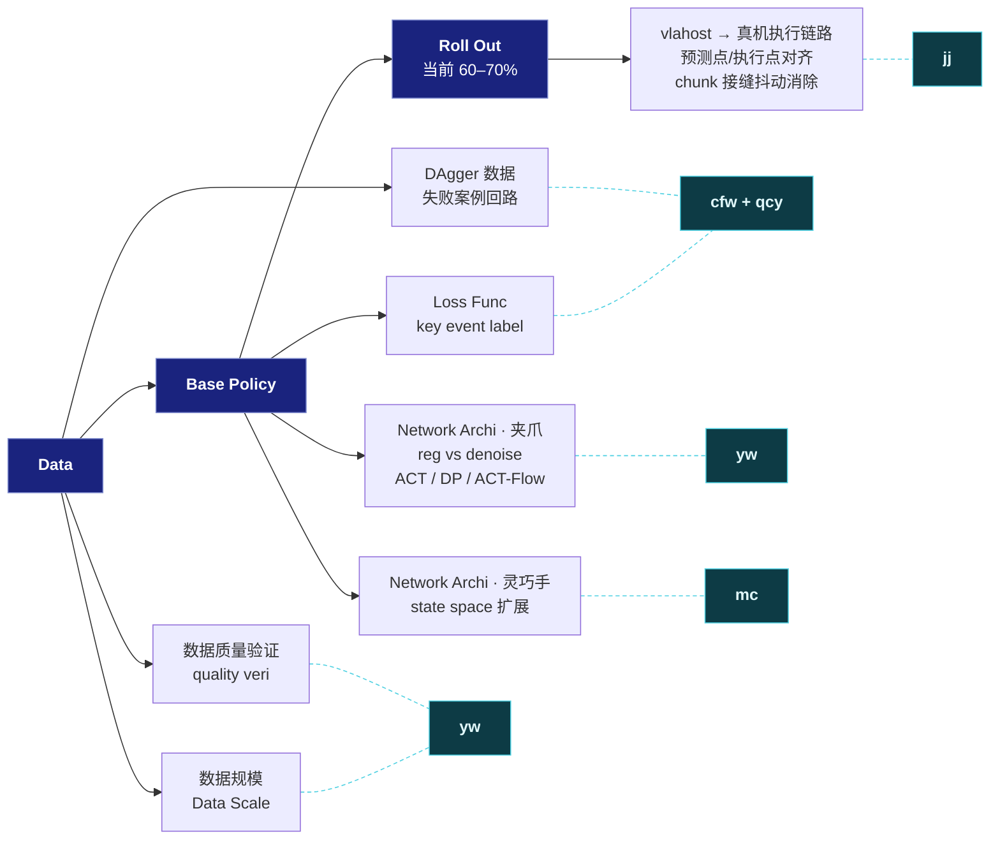
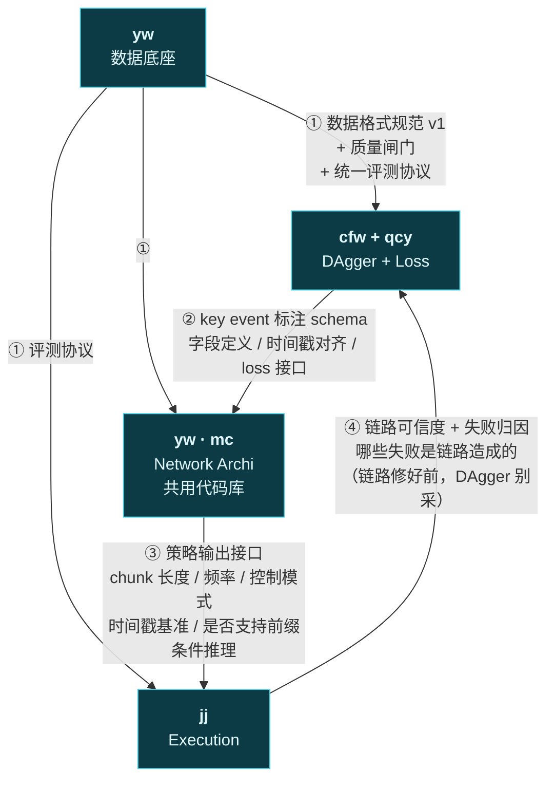
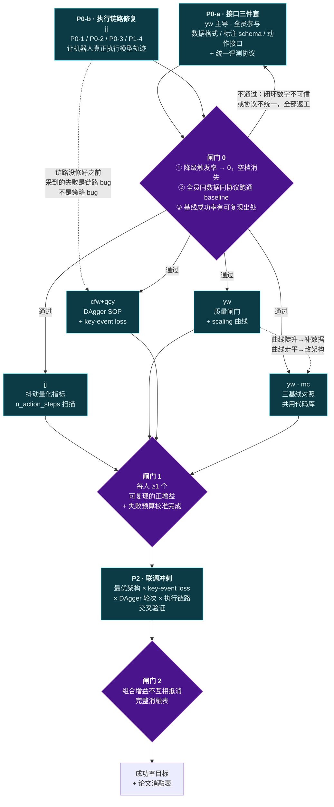

# 任务分工 · 详细策略版

> 撰写日期：2026-08-19
> 来源：2026-08-19 组会白板（Data → base policy → roll out，当前 roll out 成功率 60–70%）
> 口播版见 [`team-division-briefing-2026-08.md`](./team-division-briefing-2026-08.md)
> 本文所有"已有结论"均指向本目录下已完成的报告，链接在各节 §*.5「先读这个」。

---

## 0. 一页结论(分工五个方向)

| 谁 | 管什么 | 一句话交付 |
|---|---|---|
| **yw** | 数据质量验证 | 数据初筛过滤，“决定什么数据能进训练集“ |
| **cfw + qcy** | DAgger 数据 + Loss Func（key event label） | 让失败案例**真的**变成有用的监督信号 —— 上次加失败数据反而更差，这次要搞清楚为什么 |
| **yw** | Network Archi · **夹爪** | 在同一份数据上把 **ACT / DP / ACT-Flow** 打平了比，定出回归派还是去噪派更稳 |
| **mc** | Network Archi · **灵巧手** | 沿用 yw 那套骨干和评测协议，只换动作空间与表征，回答高维手怎么建模 |
| **jj** | **vlahost → 真机执行链路** | 让机器人**真正执行模型输出的轨迹** —— 预测点/执行点对齐、chunk 接缝抖动消除 |

**分工原则：按失败原因分，不按模块分。** 白板上那棵树是**技术分解**，
直接照抄成分工表会出一个典型问题 —— 每个人都能说"我的模块做完了"，
但成功率一点没动，因为没有人对**那 30–40% 的失败**负责。

所以本文做了三件事：

| # | 做的事 | 为什么 |
|---|---|---|
| 1 | 把白板五个模块**映射成五个 owner**，每个 owner 认领一段**失败预算** | 交付物是"成功率涨了几个点"，不是"代码写完了" |
| 2 | 定义 **4 条接口契约**（数据格式 / 标注 schema / 动作接口 / 失败回流） | 五路并行最大的风险不是做不出来，是做出来拼不上 |
| 3 | 设 **3 个阶段闸门**，闸门不过不许进下一阶段 | 尤其是 P0：评测协议不统一，后面所有数字都不可比 |

**两个最高优先级的前置条件（P0 阻塞项）：**

1. **那个 60–70% 没有可复现的出处。** `failure-data-in-imitation-2026-08.md` 查过，
   三个 job 的 `env_eval_freq` 都是 0，磁盘上**没有任何闭环 rollout 成功率记录**。
2. **执行的根本不是模型输出的轨迹。** `vita-deploy-inference-code-audit-2026-08.md` 实测：
   **100% 的 chunk 被替换成零速起止的 Hermite S 曲线**，加上每周期 60–100 ms 硬停。
   在这条链路修好之前，闭环成功率测的是 S 曲线，不是策略。

这两条合起来的后果：**现在没有任何一个闭环数字是可信的。**
所以 §5 把 jj 的链路修复与接口对齐**并列放进 P0**，闸门 0 要同时过这两关。

---

## 1. 分工总览图

白板原图是技术分解，下图是**同一棵树按 owner 重新着色**后的版本：

**与白板的两处差别，需要确认：**

1. 白板上 **Loss Func 挂在 base policy 下**，本文把它划给 cfw/qcy（而不是 yw/mc）。
   理由：key event label 的**定义权和标注权**在数据侧，
   loss 只是把标注用起来的那一步；标注和 loss 分给两拨人，扯皮成本极高。
   **但代价是** yw/mc 的训练代码里要接一个不是自己定义的 loss —— 靠 §4.2 的 schema 契约兜住。
2. 白板上 **quality veri / Data Scale 没有 owner**，本文划给 yw（已确认）。

---

## 2. 失败预算：那 30–40% 归谁

这张表是**分工的真正依据** —— 每个 owner 认领一段失败，
P1 结束时对着自己那段报数。初值是估计，**P1 里由 jj 的失败模式统计校准**（§3.5）。

| 失败类型 | 估计占比 | 主责 | 判据（怎么算这类失败） |
|---|---|---|---|
| 数据里根本没覆盖的状态 | ~8–12% | yw | 失败帧在训练集里找不到近邻 |
| 覆盖了但示范本身质量差 / 前后不一致 | ~5–8% | yw | 同一状态邻域下条件动作分歧大（已有度量，见 §3.1.5） |
| 失败后无法自恢复（缺纠错数据） | ~6–10% | cfw + qcy | 首次偏离后不再回到成功轨迹 |
| 关键时刻精度不够（接触/闭合/提起瞬间） | ~5–8% | cfw + qcy（loss）+ yw/mc（架构） | 失败集中在 key event 前后 N 帧 |
| 架构表达力 / 多模态坍塌 | ~4–8% | yw（夹爪）· mc（灵巧手） | 同数据下换架构能修好 |
| 执行链路：预测点/执行点错位、chunk 接缝抖动、发布空档 | **未知，可能远高于 10%** | jj | 同一 checkpoint 修链路就能修好 |

> **最后一行现在是整张表里最危险的一格。** `vita-deploy-inference-code-audit-2026-08.md`
> 的实测是：**机器人从来没有执行过模型输出的轨迹** —— 100% 的 chunk 被替换成了
> 一条零速起止的 Hermite S 曲线（§3.5.1）。在这条链路修好之前，
> 这一格无法估计，而且它**可能已经吃掉了其他所有格的份额**：
> 上面五行的失败，有多少其实是链路造成的，现在没人知道。
>
> 所以 §5 把 jj 的链路修复从 P1 提到了 **P0**，与接口对齐并列 ——
> 它不是并行优化项，是其他四路闭环数字的前置条件。

---

## 3. 各方向任务详解

### 3.1 yw —— 数据质量验证 + 数据规模

**为什么这两件事必须由一个人管：** 它们回答的是同一个问题 ——
"我们现在是**缺数据**还是**缺架构**"。这个答案决定另外四个人的优先级。

**3.1.1 quality veri（质量闸门）**
- 定义单条 demo 的可量化质量指标：轨迹平滑度、关键帧完整性、首尾对齐、
  接触时刻一致性、成功标注可信度、**采集会话一致性**（背景/光照/物体摆放）。
- 双闸门：自动筛除（脚本）+ 人工抽检（比例定 5–10%）。
- **必须输出"为什么被筛掉"**，不能只给一个布尔值 —— cfw/qcy 要靠这个反推采集 SOP。

**3.1.2 Data Scale（数据量-性能曲线）**
- 固定架构、固定评测协议，测 25% / 50% / 100% 数据量的闭环成功率。
- 曲线**还在陡升** → 全组优先补数据；曲线**已经平了** → 全组优先改架构/执行层。
- 这是本季度**唯一一个能给全组定优先级的实验**，优先级最高。

**3.1.3 交付物**
数据规范文档 v1（格式冻结）· 质量评分脚本 · scaling 曲线报告 · 统一评测协议 v1 ·
**通用失败类型标注规范**（原挂在 jj 名下，随其范围收窄并入此处，见 §3.5 末）

**3.1.4 验收**
其余四人都能用规范 v1 加载数据、用协议 v1 报出可比对的成功率

**3.1.5 先读这个**
[`failure-data-in-imitation-2026-08.md`](./failure-data-in-imitation-2026-08.md)（会话块污染、条件动作分歧 18× 的度量方法）·
[`Image_quality_to_motion_quality.md`](./Image_quality_to_motion_quality.md)（图像质量→动作质量的已有实验设计）·
[`real-world-policy-evaluation-2026-08.md`](./real-world-policy-evaluation-2026-08.md)（评测协议的十个方案）

---

### 3.2 cfw + qcy —— DAgger 数据 + Loss Func（key event label）

**这一组的起点是一个已知的坏结果：** 上一轮加入失败数据后表现**反而更差**
（361 成功 + 36/72 失败三组权重实测）。原因已经查清是三条负载叠加：
独立采集会话块污染、同状态下 18× 的条件动作分歧、episode 系统性更长。
**所以这组的任务不是"再加一次失败数据"，而是"把这三条负载拆干净后再加"。**

**建议的组内分工**（可调，两人自己定）：

| | cfw | qcy |
|---|---|---|
| 主线 | DAgger 采集回路 | key event 标注 + loss |
| 具体 | 失败态定义、专家接管协议、每轮加多少数据、分布崩塌监控 | 事件定义、半自动标注工具、加权/辅助头 loss 实现 |

**3.2.1 DAgger 回路要解决的**
- "什么算失败" 的可操作定义（不能靠人眼主观判）
- 失败态回放 + 专家接管的采集 SOP —— **同场次、同背景、同摆放随机化**，
  避免再引入一个新的会话块（这是上次翻车的头号原因）
- 每轮加入比例、迭代轮次上限、分布崩塌的监控指标

**3.2.2 key event label 要解决的**
- 事件定义：接近 → 接触 → 闭合 → 提起 → 移动 → 放置 → 释放
- 半自动打点：用夹爪开合信号、接触/力信号、速度过零点自动生成候选，人工只做校正
- loss 三个候选：关键帧加权 · 事件分类辅助头 · 时序对齐损失
- **必须做消融**：证明 key-event 加权确实优于均匀加权，否则这一支不该进最终方案

**3.2.3 交付物**
失败案例库 + DAgger 采集 SOP · 标注规范 + 标注工具 · loss 实现 + 消融表

**3.2.4 验收**
在**同一架构、同一评测协议**下，加 DAgger 数据后闭环成功率**不降**（这是底线），
key-event loss 相对均匀加权有可复现正增益

**3.2.5 先读这个**
[`failure-data-in-imitation-2026-08.md`](./failure-data-in-imitation-2026-08.md) —— **全文，这是你们的实验起点**

---

### 3.3 yw —— Network Archi · 夹爪

**主战场是白板上那个括号：`reg vs denoise`。**
即回归派（ACT）和去噪/生成派（DP、ACT-Flow）在**我们这个数据规模和任务**上到底哪个更稳。
文献上的结论不能直接拿来用 —— 大多在别人的数据量上测的。

**3.3.1 要打平的三条基线**
同一份夹爪数据、同一视觉主干、同一动作块长度、同一评测协议下比 **ACT / DP / ACT-Flow**。
报告至少三个维度：闭环成功率 · 推理延迟 · 多模态场景下的表现。

**3.3.2 这一支的隐藏交付：代码库**
yw 搭的训练/评测代码库 **mc 要直接复用**。
所以从第一天起就按"两种手型都要能跑"的方式写 —— 动作空间和表征做成可配置项，
不要写死成夹爪。这不是额外工作，是省掉 mc 重写一遍的成本。

**3.3.3 交付物**
统一训练/评测代码库（与 mc 共用）· 三基线对照表 · 成功率-延迟帕累托图

**3.3.4 验收**
能明确回答"我们的场景选回归还是去噪"，且结论有消融支撑，不是单次跑分

**3.3.5 先读这个**
[`act-diffusion-integration-2026-08.md`](./act-diffusion-integration-2026-08.md)（ACT×DP 架构差异与十个融合方案）·
[`flowmatching-image-to-action-plan-2026-08.md`](./flowmatching-image-to-action-plan-2026-08.md)（ACT-Flow 一支）·
[`vision-backbone-why-resnet18-2026-08.md`](./vision-backbone-why-resnet18-2026-08.md)（主干先别动，理由在里面）·
`experiment_report/act/`（已有的 ACT 实验计划与 act_delta 失败分析）

---

### 3.4 mc —— Network Archi · 灵巧手

**主战场是白板上那个括号：`state space`。** 灵巧手的难点不在骨干网络，
在动作空间本身 —— 维度高、自由度耦合、接触丰富、示范更难采干净。

**3.4.1 要回答的**
- 动作表征怎么选：关节角 vs 指尖位姿 vs 混合 vs 加触觉
- 高维动作空间下 chunk 长度该不该变
- 手型差异下，yw 定出来的"回归 vs 去噪"结论**还成不成立**

**3.4.2 硬约束（本次分工里最容易出问题的地方）**
**必须复用 yw 的代码库和评测协议，只改动作空间与表征。**
如果两人各写各的，最后出现"夹爪上 DP 好、灵巧手上 ACT 好"，
我们将无法判断这是**手型的差别**还是**实现的差别** —— 这个结论就废了，
而且是那种要重跑两个月才能补救的废。

**3.4.3 交付物**
动作表征方案对照表 · 与夹爪**同协议**的成功率对比 · 手型差异分析

**3.4.4 验收**
灵巧手结论能与 yw 的结论放进同一张表比较

**3.4.5 先读这个**
同 §3.3.5，外加 [`no-embodiment-to-real-robot-2026-08.md`](./no-embodiment-to-real-robot-2026-08.md)
（高自由度手的数据采集与执行链路痛点）

---

### 3.5 jj —— vlahost → 真机执行链路

**范围（本次已收窄）：** 不做重规划、不做失败检测重试、不调阻抗柔顺参数。
只做一件事 —— **让机器人真正执行模型输出的那条轨迹**。两个靶子：
① **预测点与执行点的差值平滑**；② **chunk 之间的接缝抖动消除**。

**3.5.1 好消息：靶子已经定位过了，而且带行号**

`vita-deploy-inference-code-audit-2026-08.md` 把这条链路审计完了，结论一句话：
**机器人从来没有执行过模型输出的轨迹。** 你要解决的两个问题，根因都已定位：

| 你说的问题 | 已定位的根因 | 位置 | 实测 |
|---|---|---|---|
| **预测点 vs 执行点的差值** | **P0-1**：chunk 拒绝阈值 `threshold_rad` = 0.0087 rad（0.5°），而实际 `max\|action0 − state\|` 中位数 **0.1178 rad（6.7°）** → **100% 的 chunk 触发降级**，整条被换成零速起止的三次 Hermite S 曲线，中间 7 帧形状全丢 | `core.py:474-533` | 52 块 200k 原始 chunk |
| **接缝处那段反向运动** | **P1-4**：两侧锚点定义不一致 —— 客户端锚**实测关节角**，服务端 blend 锚**上次下发的指令**，而手臂天然落后指令 0.025 rad，于是每块开头有一段方向相反、速度约 0.75 rad/s（块内典型速度的 3 倍）的桥接 | `core.py:551` + `vla_node.py:824-836` | 83% 的接缝是回退，`\|seam\|/\|v_prev\|` 中位数 **3.18×** |
| **chunk 间的顿挫** | **P0-2**：服务端整块播完才请求下一块、播完就停止发布 → 每周期 60–100 ms 硬停 | `vla_node.py:451-461`, `939-961` | 走-停-走-停，周期 ≈ 3 Hz |
| 白扔一次推理 | **P0-3**：「连续拒绝 2 次」在确定性策略上是死仪式，第二次必然重复第一次 | `core.py:474-537` | — |

> 注意第二行：**这就是你说的「预测点与执行点的差值」，但根因不是模型首帧偏移，
> 是两侧对「当前位置」的定义不同。** 两侧同时"从当前位置平滑接入"是最坏的组合。

**3.5.2 任务 = 执行修复清单 → 复测**

按 audit §7 的顺序做，这个顺序是按"修了立刻见效"排的，别自己重排：

1. **P0-2** 服务端 `remaining <= lead_setpoints` 提前请求（一行）→ 空档消失
2. **P0-1 + P0-3** 删掉重试；阈值抬到 3°；`K = chunk_len // 2`，让降级走
   "桥接前几帧、末速度对齐"的正确分支 → 执行流回到模型轨迹，两端不再归零
3. **P1-4** 桥接锚点统一到"上一次下发的指令"，**或**关掉服务端 `chunk_blend_from_current`
   —— **二选一，不要两边都留着**
4. 复测（见 3.5.4）

**3.5.3 必须先补的一路记录**

现在只有模型原始输出（`record_chunk.txt`），**没有"实际下发的 chunk"**，
所以"模型输出 vs 真正执行"的差只能靠仿真脚本反推。
**加一路实际下发轨迹的记录，是后面所有量化指标的前提，先做这个。**

**3.5.4 量化指标（不许用肉眼判断"顺了"）**

- 降级触发率（P0-1 修好后应 → 接近 0）
- 接缝回退比例 + `|seam|/|v_prev|` 比值 —— **已有脚本**，audit §8
- 指令加加速度（jerk）RMS，块内 / 接缝分开统计
- 指令-实测跟踪误差与滞后
- 发布空档时长占比（应 → 0）
- chunk 内归一化速度剖面（训练集应为平的 ~1.0；**钟形 = 滤波痕迹**，说明执行的不是模型输出）

**3.5.5 延伸（本期非核心，上面做完再说）**

- **异步推理 / chunk 重叠**：仓库里已有 `src/lerobot/policies/rtc/`（Real-Time Chunking），
  **别重写** —— 但它要求策略侧支持前缀条件推理，这是对 yw/mc 的新约束，见 §4 契约 ③
- **`n_action_steps` 直接决定接缝频率**（vibration doc §6.3）—— 最便宜的旋钮，先扫一遍
- 自适应 horizon（continue or replan）：已有阅读笔记，本期只读不做

**3.5.6 交付物**
链路修复（P0-1 / P0-2 / P0-3 / P1-4）· 实际下发 chunk 的记录通路 ·
抖动量化指标脚本 · 修复前后对照表（**每一项的独立增益，不能只给组合数**）

**3.5.7 验收**
降级触发率 → 接近 0（执行的确实是模型轨迹）· 发布空档消失 ·
接缝回退比例显著下降 · **并给出修复前后的闭环成功率对比**

**3.5.8 先读这个**
`experiment_report/vita/vita-deploy-inference-code-audit-2026-08.md` —— **全文，这就是你的任务书** ·
`experiment_report/vita/vita-deploy-vibration-2026-08.md`（§5.4 接缝顿挫、§6 三个超参与抖动的关系）·
[`BCP-continue-or-replan.md`](./BCP-continue-or-replan.md)（延伸）

**3.5.9 必须先问清楚的一件事**

白板上那个 **60–70% 是不是通过这条链路测出来的？**
如果是 —— 那它测的是 Hermite S 曲线的成功率，不是策略的成功率。
**那么 jj 的修复就不是 P1 的并行项，而是闸门 0 的前置项**（见 §5、§8）。

> **收窄后无人认领的部分**：失败检测与重试、局部再规划、阻抗/柔顺参数整定，
> 以及原本挂在 jj 名下的**通用失败模式清单**。
> 通用失败类型标注规范已并入 yw 的统一评测协议（§3.1.3、§6）；
> 其余三项目前**没有 owner**，见 §8。

---

## 4. 接口契约：五路并行的拼接点

**并行开发最大的风险不是做不出来，是做出来拼不上。** 下图是人与人之间实际要传的东西：

**④ 现在是一条阻塞边，不只是回流边。** jj 收窄范围后，这条边传的不再是通用失败清单，
而是一个更硬的信号：**这条链路现在可不可信**。

> **cfw / qcy 注意**：链路修好之前**不要开始采 DAgger 数据**。
> 现在执行的是 Hermite S 曲线（§3.5.1），此时采到的"失败案例"大部分是链路 bug 的产物，
> 拿它做纠错监督，等于**教策略去补偿一个马上就要被修掉的 bug**。
> 上一轮加失败数据反而更差的教训已经够贵了，这次别再赔一次。

| # | 契约 | 出方 → 入方 | 冻结时点 | 冻结后改动的代价 |
|---|---|---|---|---|
| ① | 数据格式 + 质量闸门 + 评测协议 | yw → 全员 | **P0 末，硬冻结** | 全组重跑，代价最高 |
| ② | key event 标注 schema | cfw/qcy → yw/mc | P0 末（可留一次扩展位） | yw/mc 重训 |
| ③ | 策略输出接口 | yw/mc → jj | P0 末 | jj 执行层重写 |
| ④ | 链路可信度 + 链路侧失败归因 | jj → cfw/qcy | **P0 末（阻塞 cfw/qcy 采集）** | 采到的 DAgger 数据作废 |

> **①、②、③ 在 P0 末一次性冻结。** 冻结后的任何改动都要全组同意 ——
> 不是流程洁癖，是因为改①等于全组重跑。
>
> **契约 ③ 新增一条要求**：如果 jj 后面要走 RTC / chunk 重叠（§3.5.5），
> 策略必须支持**以上一块 chunk 的前缀为条件**做推理。
> 这件事**必须在 P0 就决定要不要留**，事后加等于 yw/mc 重训。

---

## 5. 阶段推进与闸门

不设日期，只设**闸门**：闸门不过，不进下一阶段。

**与上一版的差别：jj 从 P1 提到了 P0。**
理由在 §3.5.9 —— 如果那个 60–70% 是通过这条链路测的，
那它测的是 Hermite S 曲线，不是策略。闸门 0 的第 ① 条就是为此加的：
**先证明"执行的确实是模型输出的轨迹"，闭环数字才有意义。**

**剩下那条虚线仍是排序依据，不是可选项：**
yw 的 scaling 曲线要早出 → 决定全组是补数据还是改架构。

所以 **P1 不是纯并行**：yw 的结论要早，另外三路据此调优先级。

---

## 6. 评测机制（唯一硬性流程要求）

| 规则 | 内容 |
|---|---|
| 统一 benchmark | 固定任务集 + 固定初始状态分布 |
| 固定随机性 | 固定 seed，固定 rollout 次数（建议 ≥ 30 次/配置） |
| 报数格式 | 成功率 + 置信区间 + 失败类型分布，**三样缺一不可** |
| 禁止 | 各组自报不同协议下的数字 —— 不可比的数字比没有数字更糟 |
| 每次消融 | 只改一个变量。改两个的结果不进最终表 |

> 之所以把这条单列一节：`failure-data-in-imitation-2026-08.md` §4 的教训是
> **离线指标看不出"变差"，伤害只发生在闭环**。
> 没有统一闭环评测，五个方向做的全是离线自嗨。

---

## 7. 风险清单

| 风险 | 触发信号 | 应对 |
|---|---|---|
| **60–70% 是在破损链路上测的** | jj 修完 P0-1/P0-2 后成功率**变了**（涨或跌都算） | 旧基线作废，以修复后的数字为准重设目标；这不是坏消息，是终于开始测真东西 |
| **60–70% 复现不出来** | P0 闸门卡住 | 最高优先级，全组停下来一起补闭环评测；这不是耽误进度，这是进度本身 |
| **cfw/qcy 在链路修好前采了 DAgger 数据** | P0-b 未完成但采集已开始 | 数据作废重采 —— 那些"失败"是链路 bug，纠错监督会教策略去补偿一个即将消失的 bug |
| **jj 修完链路后其余四路的失败预算全变** | §2 那张表与实测对不上 | 预期之内：§2 本来就是估计值，以修复后的失败归因重排优先级 |
| **yw / mc 代码库分叉** | 两边出现独立的训练脚本 | P0 就定共用仓库与分支策略；mc 在 yw 的库上开分支，不新建仓库 |
| **DAgger 再次引入会话块污染** | 新数据的背景/光照统计与原集显著不同 | 采集 SOP 强制同场次同布置；入库前跑 yw 的质量闸门，统计量不通过就不入库 |
| **key event 标注主观、两人不一致** | 标注一致性低 | 先做双人标注一致性检查，不达标先修规范再标 |
| **执行层增益与架构增益重叠** | 组合后总增益 < 各自增益之和 | P2 交叉验证时做 2×2 消融，别只报最优组合 |
| **五路各自算自己的成功率** | 报数格式不统一 | §6 的报数格式作为组会硬性要求 |

---

## 8. 待确认

1. **成功率目标定多少？** 60–70% → 目标是 80%？85%？
   目标值决定 §2 失败预算怎么分，也决定 P2 什么时候算收尾。
2. **cfw / qcy 组内分工**按 §3.2 那张表拆，还是两人各做端到端然后交叉验证？
3. **灵巧手硬件到位情况** —— 如果 mc 前期没有真机，P1 是否先在仿真/离线指标上做，
   闭环数字留到硬件到位后补？这会影响他能不能过闸门 1。
4. **白板那个 60–70% 是不是通过 vlahost → 真机这条链路测的？**（§3.5.9）
   是 → jj 的修复是全组闸门 0 的前置项，本文已按此排；
   不是 → jj 可以退回 P1 并行，闸门 0 只留接口那一关。**这条决定整个 P0 的形态，先回答它。**
5. **收窄后无人认领的三项**：失败检测与重试、局部再规划、阻抗/柔顺参数整定。
   本期不做？还是等 jj 链路修完后作为他的第二阶段？
6. **RTC / chunk 重叠这条路本期留不留？**（§3.5.5、契约 ③）
   留 → yw/mc 的策略接口 P0 就要预留前缀条件推理，事后加等于重训；
   不留 → jj 只做同步链路的缝合，接缝频率靠 `n_action_steps` 调。
